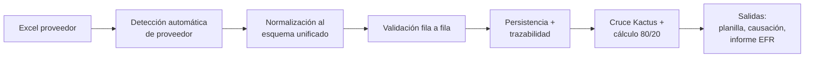

# Visión del Sistema SIGA

| Campo        | Valor                                                                       |
|--------------|------------------------------------------------------------------------------|
| Versión      | 1.0                                                                          |
| Fecha        | 2026-05-13                                                                   |
| Fuente       | Documentación Funcional §1–§2; Documento Funcional Beneficios de Salud (intro) |
| Responsable  | Equipo SIGA / Talento Humano                                                  |
| Estado       | Borrador                                                                     |

---

## 1. ¿Qué es SIGA?

**SIGA** (Sistema Inteligente de Gestión Administrativa) es el módulo administrativo de Finagro orientado al procesamiento de información operativa de Talento Humano. El primer subdominio implementado es **Beneficios de Salud**, que automatiza:

- la conciliación mensual de facturas de las aseguradoras AXA Colpatria y Colsanitas,
- la validación de beneficiarios contra la nómina de Kactus,
- el cálculo de la planilla de medicina prepagada bajo el modelo 80/20 (empresa/empleado),
- la clasificación tributaria del aporte de la empresa (apoyo gravable vs no gravable, Art. 387 E.T.), y
- la generación de salidas para contabilidad e informe EFR.

## 2. Problema que resuelve

Antes de SIGA la gestión del beneficio de salud operaba bajo un modelo **manual** y heterogéneo:

| Síntoma anterior                                                                 | Riesgo asociado                                |
|----------------------------------------------------------------------------------|-------------------------------------------------|
| Cada aseguradora entregaba Excel con estructura distinta                         | Errores humanos al unificar columnas            |
| Conciliación, deduplicación y unificación manuales por un analista              | Dependencia del criterio de la persona          |
| Sin trazabilidad por archivo o por fila                                          | Reclamaciones difíciles de soportar             |
| Cálculo 80/20 en hojas externas, sin control de UVT vigente                      | Riesgo tributario y de consistencia             |
| Ausencia de historial de archivos cargados                                       | Imposibilidad de reconstruir periodos pasados   |

## 3. Propuesta de valor

SIGA convierte ese flujo manual en un **pipeline ETL auditable**:

Los beneficios cuantificables documentados en las fuentes son:

| Dimensión             | Antes                                 | Con SIGA                                                            |
|-----------------------|----------------------------------------|----------------------------------------------------------------------|
| Tiempo de ETL         | 2–4 horas por periodo por proveedor    | < 20 segundos por archivo                                            |
| Tolerancia aritmética | Sin control                            | ± COP 1.00, registro con advertencia si excede                       |
| Deduplicación         | Manual y posterior                     | SHA256 del archivo + cédula/subcontrato en validación                |
| Auditoría             | Sin trazabilidad                       | Archivo persistido en disco + `archivo_id` + `fila_origen` por error |
| Cálculo 80/20         | Manual sin control de UVT              | Motor automático con política versionable                            |
| Consolidación         | Reporte unificado a mano                | Excel multihoja generado bajo demanda                                |

## 4. Alcance funcional

Las capacidades declaradas en la Documentación Funcional §2 son:

| Capacidad                  | Descripción breve                                                                  |
|----------------------------|-------------------------------------------------------------------------------------|
| Carga de archivos          | Recepción de Excel `.xls`/`.xlsx` por portal o API.                                 |
| Detección de proveedor     | Identifica AXA Colpatria o Colsanitas por nombre o columnas características.        |
| Persistencia del original  | Archivo guardado en `storage/landing/{proveedor}/`.                                 |
| Lectura flexible           | Detección de fila de encabezado y extracción de metadatos (contrato, periodo).      |
| Normalización              | Adaptadores por proveedor a esquema unificado `BeneficioSalud`.                     |
| Validación                 | Cédula, valores numéricos, consistencia aritmética y duplicados.                    |
| Registro de errores        | Errores y advertencias con fila de origen y descripción.                            |
| Consulta y exportación     | Consolidado por archivo, proveedor, cédula y estado de validación.                  |
| Novedades                  | Comparación entre dos archivos para detectar altas, bajas y cambios de valor.        |
| Dashboard                  | Resumen ejecutivo por proveedor, parentesco, evolución.                              |
| Medicina prepagada 80/20   | Cálculo de planilla, UVT, elegibilidad y exportación.                                |
| Reportes administrativos   | Causación, conciliación entre periodos, informe EFR mensual.                        |

> ℹ️ El alcance actual está acotado a **Beneficios de Salud / Medicina Prepagada**. Otros submódulos (vacaciones, cesantías, etc.) son **roadmap** declarado, ver [`../01-funcional/requerimientos-funcionales.md`](../01-funcional/requerimientos-funcionales.md) y `procesos-de-negocio.md`.

## 5. Fuera de alcance (a la fecha)

Las siguientes reglas del Manual de Talento Humano (THU-DOC-002 v13) están descritas en la fuente pero **no están implementadas** en SIGA actualmente. Se documentan como roadmap en [`../01-funcional/reglas-de-negocio.md`](../01-funcional/reglas-de-negocio.md):

- Auxilio educativo para hijos, vacaciones, primas extralegales, préstamo de libre inversión, FONDEFIN, pólizas externas, etc.
- Reglas de elegibilidad complejas: antigüedad mínima, estado civil, dependencia económica, sustitución de beneficiarios, hijos discapacitados.

## 6. Audiencias de esta documentación

Este set documental sirve a tres audiencias:

| Audiencia                          | Ruta de lectura recomendada                                                    |
|------------------------------------|---------------------------------------------------------------------------------|
| Nuevos miembros del equipo         | [`../06-onboarding/README.md`](../06-onboarding/README.md)                      |
| Cliente / auditores externos       | [`../07-entrega/checklist-entrega.md`](../07-entrega/checklist-entrega.md)      |
| Equipo de mantenimiento y operación| [`../04-operacion/runbook.md`](../04-operacion/runbook.md)                       |

---

**Fuente:** `siga/DOCUMENTACION_FUNCIONAL.md` (§1–§2), `siga/DOCUMENTO_FUNCIONAL_BENEFICIOS_SALUD.md` (Desafío Institucional, Propuesta de Valor, Tabla de Dimensiones).
