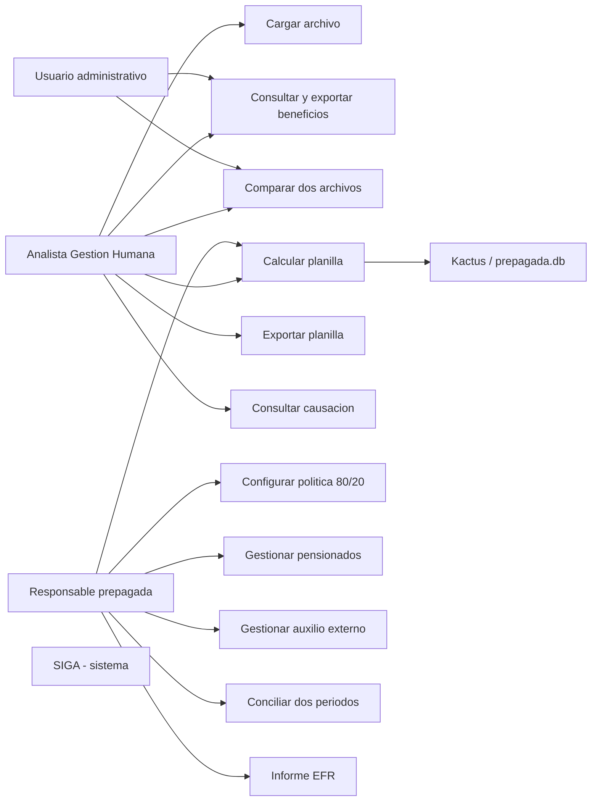

# Casos de Uso

| Campo        | Valor                                                                          |
|--------------|---------------------------------------------------------------------------------|
| Versión      | 1.0                                                                             |
| Fecha        | 2026-05-13                                                                      |
| Fuente       | Documentación Funcional §4 (flujo funcional); Documento Funcional Beneficios de Salud |
| Responsable  | Equipo SIGA / Talento Humano                                                    |
| Estado       | Borrador                                                                        |

---

> ℹ️ Las fuentes no formalizan casos de uso con plantilla actor/precondición/postcondición. Los siguientes se construyeron a partir de los flujos documentados y se identifican como `CU-XXX`.

## CU-001 — Cargar archivo de facturación de proveedor

| Campo                   | Valor                                                                                       |
|--------------------------|----------------------------------------------------------------------------------------------|
| **Actor primario**       | Analista de Gestión Humana                                                                   |
| **Actores secundarios**   | SIGA (sistema), Proveedor (AXA / Colsanitas, fuera del sistema)                              |
| **Precondiciones**       | El usuario tiene el Excel del periodo descargado del correo corporativo.                      |
| **Disparador**           | Inicio del proceso mensual de conciliación de medicina prepagada.                            |
| **Postcondición exitosa** | Archivo guardado en disco, registro `ArchivoRecibido` en estado `PROCESADO` con contadores. |
| **Postcondición fallida**  | `ArchivoRecibido` en estado `ERROR`. El Excel queda en disco para reprocesamiento.           |

**Flujo principal:**

1. El analista accede al portal SIGA.
2. Selecciona el módulo Beneficios de Salud → Facturas EPS.
3. Carga el archivo Excel del proveedor (formulario multipart, campo `archivo`).
4. SIGA calcula el SHA256 del archivo y detecta el proveedor por nombre.
5. SIGA guarda el archivo en `storage/landing/{proveedor}/`.
6. SIGA crea `ArchivoRecibido` con estado `RECIBIDO`.
7. SIGA lee el Excel, detecta la fila de cabecera y extrae `numero_contrato` y `periodo_facturacion`.
8. El adaptador del proveedor normaliza el DataFrame al esquema unificado.
9. El validador clasifica cada registro en `OK`, `ADVERTENCIA` o `ERROR`.
10. SIGA inserta los beneficios y errores con `bulk_create`.
11. SIGA actualiza los contadores y estado del archivo a `PROCESADO`.
12. SIGA muestra al usuario: total de registros, procesados, advertencias y errores.

**Flujos alternos:**

- **A1 — Proveedor no detectable por nombre:** SIGA intenta detectarlo por columnas (`SUB CTO` y `NUMID` → AXA; `Numero de Familia` → Colsanitas). Si tampoco lo identifica, marca el archivo como `desconocido` y retorna error.
- **A2 — Cabecera no detectada:** SIGA retorna error descriptivo y el archivo queda en estado `ERROR`.
- **A3 — Archivo con SHA256 ya registrado (según F2):** SIGA rechaza la carga antes de procesar. **Discrepancia: T1 y A1 indican que no hay rechazo automático.** Ver `gaps.md` §5.

## CU-002 — Consultar y exportar beneficios consolidados

| Campo                   | Valor                                                                  |
|--------------------------|--------------------------------------------------------------------------|
| **Actor primario**       | Usuario administrativo / Analista de Gestión Humana                     |
| **Precondición**         | Al menos un archivo en estado `PROCESADO`.                              |
| **Postcondición**        | Excel descargado o JSON consultado.                                      |

**Flujo principal:**

1. El usuario abre la vista de Beneficios.
2. Aplica filtros opcionales (`archivo_id`, `proveedor`, `cedula`, `estado_validacion`).
3. SIGA retorna el listado JSON o exporta a Excel con hojas `Consolidado`, `AXA Colpatria`, `Colsanitas`.

## CU-003 — Comparar dos archivos (Novedades)

| Campo                   | Valor                                                                  |
|--------------------------|--------------------------------------------------------------------------|
| **Actor primario**       | Usuario administrativo                                                  |
| **Precondición**         | Dos archivos del mismo proveedor en estado `PROCESADO`.                  |
| **Postcondición**        | Listado de altas, bajas y cambios de valor entre los dos archivos.       |

## CU-004 — Configurar política 80/20

| Campo                   | Valor                                                                  |
|--------------------------|--------------------------------------------------------------------------|
| **Actor primario**       | Responsable de prepagada                                                 |
| **Precondición**         | Conocer los porcentajes, UVT y conceptos contables vigentes.            |
| **Postcondición**        | Política creada / actualizada con su fecha de vigencia.                  |

**Flujo principal:**

1. El responsable accede a Política 80/20.
2. Crea o actualiza los campos: `porcentaje_empresa`, `porcentaje_empleado`, `uvt_limite`, `valor_uvt`, conceptos contables, notas, `vigencia_desde`.
3. SIGA persiste la política. El histórico se conserva.

> ℹ️ MP-032 (pendiente): el cálculo actual toma la política más reciente, no la vigente al periodo. Ver `reglas-de-negocio.md` §4.

## CU-005 — Gestionar pensionados activos

| Campo                   | Valor                                                                                                |
|--------------------------|------------------------------------------------------------------------------------------------------|
| **Actor primario**       | Responsable de prepagada                                                                              |
| **Precondición**         | Pensionado identificado en una factura pero no encontrado en Kactus o marcado como inactivo.          |
| **Postcondición**        | Registro en `PensionadoPrepagada` con sus campos (cédula, nombre, EPS, valor mensual, fechas, observ.). |

## CU-006 — Gestionar auxilio externo

| Campo                   | Valor                                                                                                |
|--------------------------|------------------------------------------------------------------------------------------------------|
| **Actor primario**       | Responsable de prepagada                                                                              |
| **Precondición**         | Empleado con prepagada fuera del convenio corporativo o caso especial autorizado.                    |
| **Postcondición**        | Registro en `AuxilioExterno`.                                                                         |

## CU-007 — Calcular planilla 80/20 de un periodo

| Campo                   | Valor                                                                                          |
|--------------------------|------------------------------------------------------------------------------------------------|
| **Actor primario**       | Analista de Gestión Humana / Responsable de prepagada                                           |
| **Precondición**         | Política vigente configurada; `prepagada.db` con `v_cruce` poblada para el periodo.            |
| **Postcondición exitosa**| `PlanillaCalculo` creada con sus `DetalleCalculo`.                                              |
| **Postcondición fallida**| HTTP 503 / 500 si `prepagada.db` no está disponible.                                            |

**Flujo principal:**

1. El usuario selecciona el periodo (`MMYYYY`).
2. SIGA consulta `v_cruce` en `prepagada.db` para ese periodo.
3. Para cada registro del cruce, SIGA evalúa la elegibilidad:
   - Pensionado activo → `PENSIONADO_100` (empresa 0 %, empleado 100 %).
   - Estado de cruce ≠ OK → `BLOQUEADO_CRUCE` (valores 0).
   - Cruce OK y no pensionado → `ELEGIBLE_80_20` (aplica política).
4. SIGA calcula `valor_empresa`, `valor_empleado`, `apoyo_no_gravable` y `apoyo_gravable`.
5. SIGA persiste `PlanillaCalculo` y sus `DetalleCalculo`.

## CU-008 — Exportar planilla a Excel

| Campo                   | Valor                                                                                |
|--------------------------|---------------------------------------------------------------------------------------|
| **Actor primario**       | Analista de Gestión Humana                                                            |
| **Precondición**         | Planilla calculada existente.                                                          |
| **Postcondición**        | Archivo `.xlsx` descargado con hojas `Planilla 80-20` y `Apoyo Gravable`.              |

## CU-009 — Consultar causación por EPS

| Campo                   | Valor                                                                                |
|--------------------------|---------------------------------------------------------------------------------------|
| **Actor primario**       | Contabilidad / Analista                                                                |
| **Precondición**         | Planilla calculada existente.                                                          |
| **Postcondición**        | Resumen por EPS con totales empresa/empleado, gravable, no gravable y total factura.   |

## CU-010 — Conciliar dos periodos

| Campo                   | Valor                                                                                    |
|--------------------------|------------------------------------------------------------------------------------------|
| **Actor primario**       | Analista / Responsable de prepagada                                                       |
| **Precondición**         | Dos planillas de periodos distintos calculadas.                                            |
| **Postcondición**        | Comparación de totales y variaciones por cédula entre los dos periodos.                     |

## CU-011 — Generar informe EFR mensual

| Campo                   | Valor                                                                              |
|--------------------------|-------------------------------------------------------------------------------------|
| **Actor primario**       | Responsable de prepagada                                                            |
| **Precondición**         | Planilla del periodo calculada; pensionados y auxilios externos actualizados.        |
| **Postcondición**        | Informe consolidando planilla + pensionados activos + auxilios externos del periodo. |

---

## Diagrama de actores y casos de uso

---

**Fuente:** `siga/DOCUMENTACION_FUNCIONAL.md` (§4 Flujo funcional, §9 Funcionalidades), `siga/DOCUMENTO_FUNCIONAL_BENEFICIOS_SALUD.md` (Pipeline ETL, Módulo Prepagada, API).
