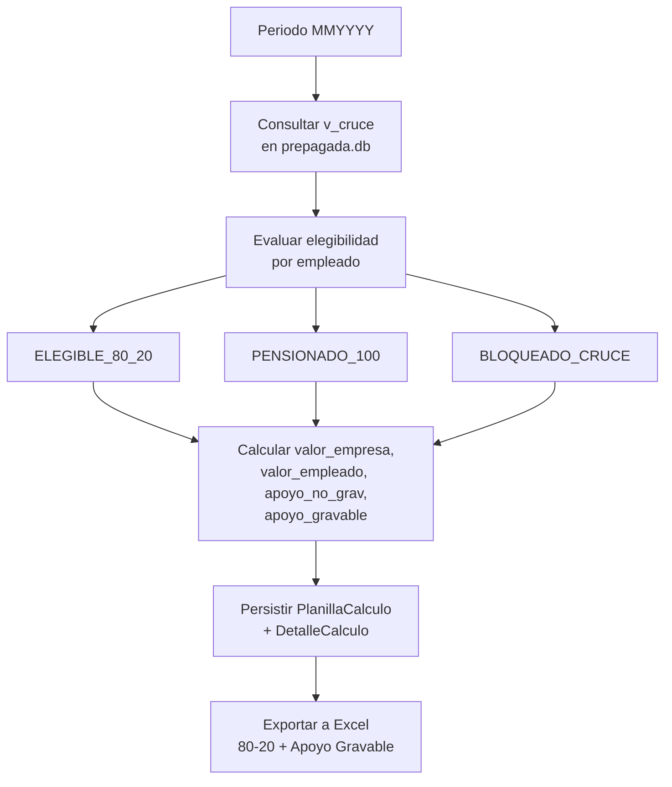

# Procesos de Negocio

| Campo        | Valor                                                                                          |
|--------------|--------------------------------------------------------------------------------------------------|
| Versión      | 1.0                                                                                              |
| Fecha        | 2026-05-13                                                                                       |
| Fuente       | Documento Funcional Beneficios de Salud; Documentación Funcional §4, §10                          |
| Responsable  | Talento Humano                                                                                   |
| Estado       | Borrador                                                                                         |

---

## 1. Proceso mensual de Beneficios de Salud

Cada mes el ciclo operativo de SIGA en su alcance actual tiene cuatro fases. El flujo a alto nivel:

## 2. Fase 1 — Recepción y carga

- **Insumo:** Excel de AXA Colpatria y de Colsanitas del periodo.
- **Acción:** subir cada archivo por el portal SIGA. SIGA detecta proveedor, normaliza, valida y persiste.
- **Salida:** dos `ArchivoRecibido` en estado `PROCESADO`. Contadores `total_registros / procesados / errores`.
- **Tiempo total típico (declarado en F2):** < 20 segundos por archivo.

> ⚠️ Si el nombre del archivo no contiene `AXA` o `COLSANITAS`, la detección por nombre falla. SIGA intenta entonces detectar por columnas; si tampoco, lo marca como `desconocido` y rechaza.

## 3. Fase 2 — Revisión de errores y novedades

| Acción                              | Resultado esperado                                                                       |
|--------------------------------------|------------------------------------------------------------------------------------------|
| Ver detalle del archivo en SIGA      | Listado de errores y advertencias con `fila_origen` para que el analista lo verifique.     |
| Notificar a la EPS para corrección   | Casos típicos: cédula vacía, valor no numérico, plantilla cambiada.                       |
| Revisar advertencias (no bloqueantes) | Casos típicos: diferencia aritmética > 1, cédula duplicada, ajuste negativo Colsanitas.     |
| Ejecutar `novedades`                  | Comparación con el archivo del periodo anterior: altas, bajas, cambios de valor.           |

## 4. Fase 3 — Configuración / verificación de política

- Validar la **política 80/20** vigente al inicio del año y cuando la DIAN publique el nuevo valor UVT.
- Confirmar los códigos contables: `cod_conc_apoyo_no_grav`, `cod_conc_apoyo_grav`, `cod_conc_dcto_empleado`.

> ⚠️ PENDIENTE (MP-032): el cálculo actual toma la política más reciente y no la vigente al periodo; al definir nueva política se debe verificar manualmente la fecha de vigencia hasta resolver esta regla.

## 5. Fase 4 — Cálculo de planilla 80/20

| Sub-proceso                      | Detalle                                                                                    |
|----------------------------------|---------------------------------------------------------------------------------------------|
| Cruce con Kactus                  | `v_cruce` en `prepagada.db` provee `cedula`, `eps`, `total_familia`, `sue_basi`, `estado`. |
| Elegibilidad                     | Aplica reglas `ELEGIBLE_80_20`, `PENSIONADO_100`, `BLOQUEADO_CRUCE`.                         |
| Cálculo                           | Fórmula 80/20 + UVT (ver `reglas-de-negocio.md` §3).                                         |
| Persistencia                      | `PlanillaCalculo` (cabecera) + `DetalleCalculo` (por cédula).                               |

## 6. Fase 5 — Causación e informe EFR

- **Causación**: resumen por EPS de la planilla más reciente del periodo (`/causacion`). Es el insumo para que contabilidad registre el gasto del mes.
- **Conciliación**: comparación entre dos periodos de planilla (`/conciliacion`).
- **Informe EFR**: salida mensual con planilla, pensionados activos y auxilios externos (`/informe-efr`).

## 7. Fase 6 — Exportación

| Exportación                                  | Hojas                                  | Uso                                       |
|----------------------------------------------|------------------------------------------|--------------------------------------------|
| Beneficios (`/exportar`)                     | `Consolidado`, `AXA Colpatria`, `Colsanitas` | Revisión administrativa, contabilidad.     |
| Planilla (`/planilla/<id>/exportar`)         | `Planilla 80-20`, `Apoyo Gravable`        | Soporte para nómina y tributaria.          |

## 8. Calendario operativo de referencia

El siguiente calendario es una guía y debe ajustarse al cronograma real del cierre contable de Finagro:

| Día hábil del mes | Actividad                                                                                                  |
|-------------------|-------------------------------------------------------------------------------------------------------------|
| D-1, D-2          | Recepción de archivos AXA y Colsanitas.                                                                     |
| D-2               | Carga en SIGA, revisión de errores, comparación con periodo anterior (novedades).                            |
| D-3               | Cálculo de planilla 80/20 y revisión de filas con apoyo gravable. Coordinación con tributaria.              |
| D-4               | Generación de causación e informe EFR. Validación cruzada con Excel manual del mes anterior si aplica.       |
| D-5+              | Registro de descuentos del 20 % empleado y devengo del 80 % empresa en Kactus.                              |

## 9. Otros procesos del Manual (roadmap)

Los siguientes procesos viven en el Manual de Talento Humano y figuran en este consolidado como **roadmap**:

- Liquidación de auxilio educativo, primas extralegales y bonificaciones por quinquenio.
- Liquidación y aprobación de vacaciones (incluida la compensación en dinero).
- Reconocimiento de auxilio de incapacidad por escalones (1–90 días, 91–180 días).
- Reconocimiento de auxilio extralegal de alimentación.
- Gestión de FONDEFIN.
- Trámite de préstamo de libre inversión y crédito educativo condonable.
- Gestión de permisos y licencias.
- Convocatorias internas, encargos, nivelación de escala salarial.

> ℹ️ Cada uno de estos procesos requiere análisis funcional propio antes de modelarse en SIGA. Ver `gaps.md` Top 10 #8.

---

**Fuente:** `siga/DOCUMENTO_FUNCIONAL_BENEFICIOS_SALUD.md` (Pipeline ETL, Módulo Prepagada), `siga/DOCUMENTACION_FUNCIONAL.md` (§4 Flujo funcional, §10 Reglas 80/20), `siga/ARQUITECTURA_SOFTWARE.md` (§5 Vista de flujo prepagada), `docs/reglas-talento-humano-siga.md`.
