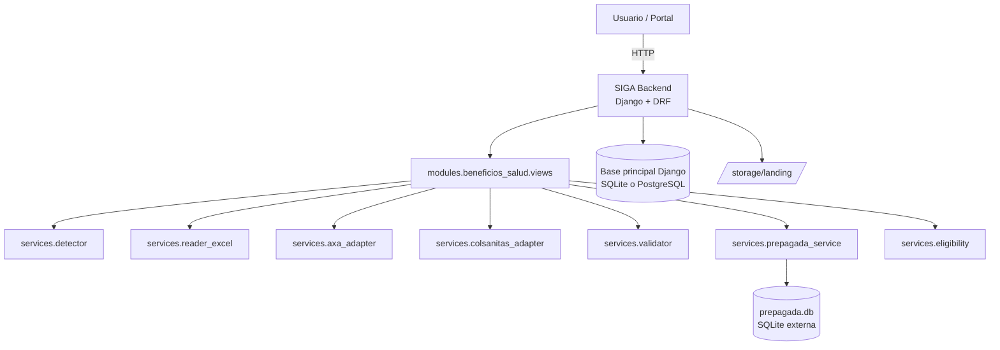
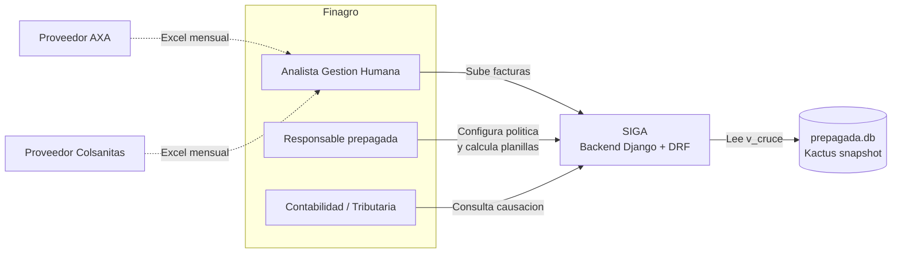
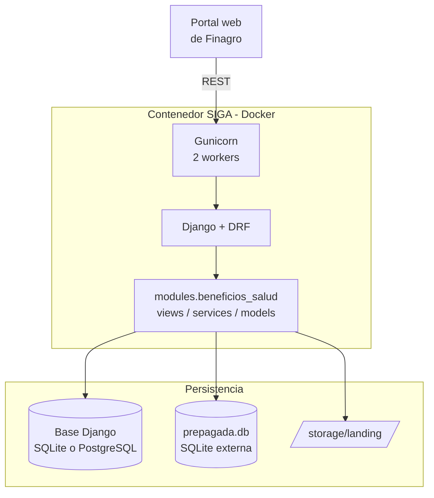
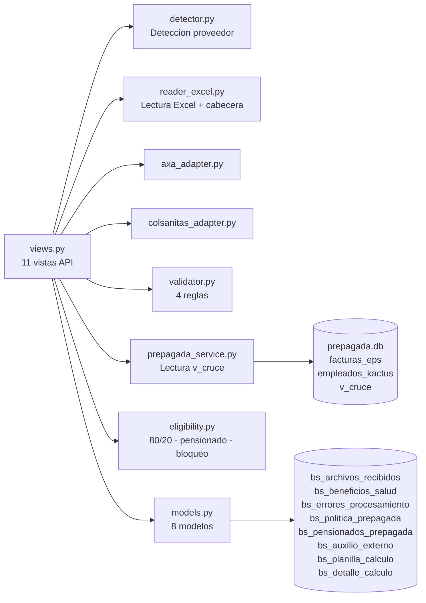
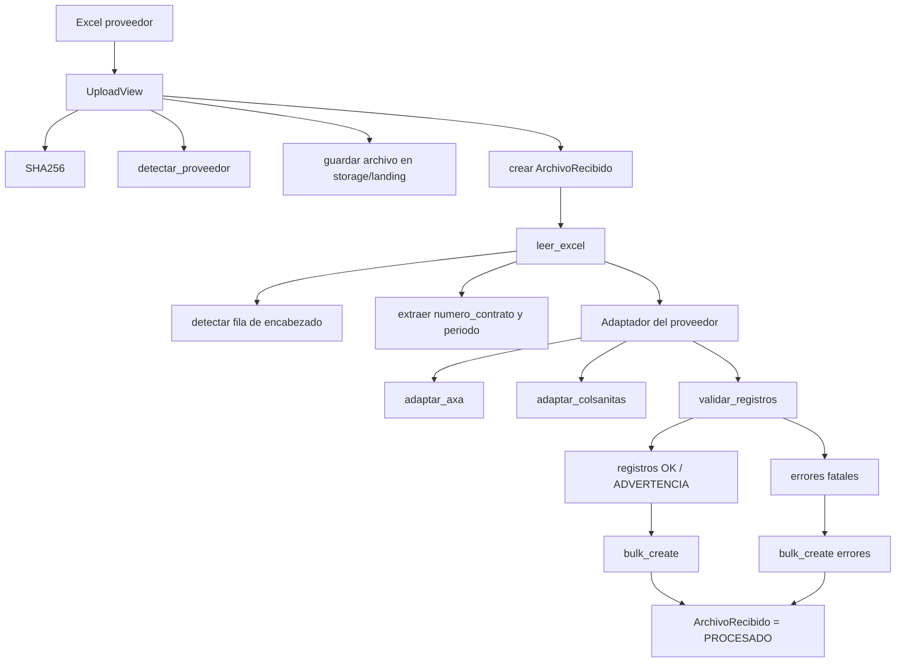
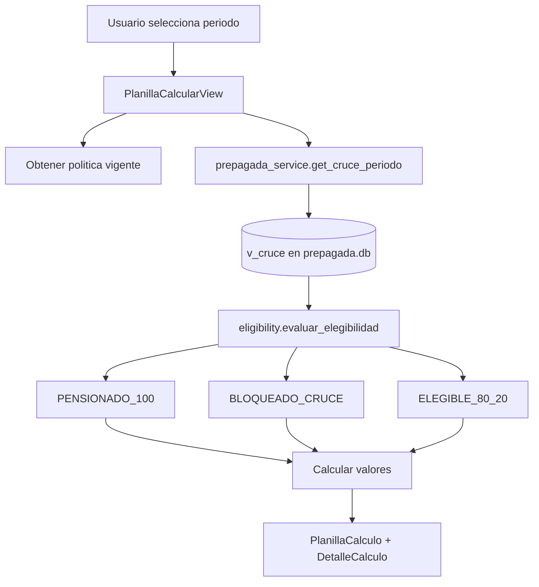
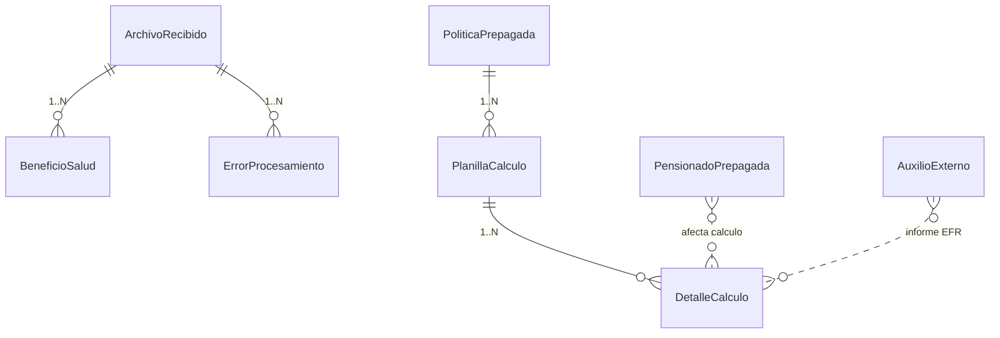

# Arquitectura General

| Campo        | Valor                                                                      |
|--------------|-----------------------------------------------------------------------------|
| Versión      | 1.0                                                                         |
| Fecha        | 2026-05-13                                                                  |
| Fuente       | Arquitectura de Software §1–§11; Documentación Técnica §1–§3                 |
| Responsable  | Arquitectura / Equipo SIGA                                                  |
| Estado       | Borrador                                                                    |

---

## 1. Vista general

SIGA es una aplicación **Django modular** orientada a procesamiento administrativo. El módulo principal actual es `beneficios_salud`, que concentra dos dominios relacionados:

1. ETL de archivos Excel de proveedores de salud.
2. Cálculo y reporte de medicina prepagada (planilla 80/20).



## 2. Estilo arquitectónico

| Aspecto                           | Decisión                                                  |
|------------------------------------|------------------------------------------------------------|
| Aplicación                         | Monolito Django modular                                    |
| API                                | REST con Django REST Framework                              |
| Dominio                             | App `modules.beneficios_salud`                             |
| Procesamiento                       | Servicios Python puros invocados desde vistas API           |
| Persistencia operacional            | ORM Django sobre SQLite/PostgreSQL                          |
| Persistencia documental             | Archivos originales en filesystem                            |
| Fuente externa prepagada            | SQLite separado (`prepagada.db`)                            |
| Exportación                         | Generación Excel bajo demanda con openpyxl                  |

## 3. Vista C4 — Nivel 1 (Contexto)



## 4. Vista C4 — Nivel 2 (Contenedores)



> ⚠️ PENDIENTE: el portal web es referenciado en F2 pero no se aporta repositorio, contrato de consumo ni equipo responsable. Sólo se sabe que consume la API en `/api/beneficios-salud/`.

## 5. Vista C4 — Nivel 3 (Componentes del módulo `beneficios_salud`)



## 6. Vista de flujo ETL (Beneficios)



## 7. Vista de flujo de medicina prepagada



## 8. Vista de despliegue (alto nivel)

```mermaid
flowchart LR
    H[Host / Docker] --> Cont[Contenedor siga]
    Cont --> Gun[gunicorn core.wsgi:application<br/>2 workers · puerto 8000]
    Cont --> Vol1[/storage]
    Cont --> Vol2[/db<br/>db.sqlite3 + prepagada.db]
    Host_user[Usuario:9010] --> H
```

Detalles operativos en [`../04-operacion/despliegue.md`](../04-operacion/despliegue.md).

## 9. Vista de datos (resumen)



Detalle del modelo de datos: [`../03-tecnico/modelo-de-datos.md`](../03-tecnico/modelo-de-datos.md).

## 10. Dependencia externa: `prepagada.db`

```text
prepagada.db (SQLite)
├── facturas_eps         -> Datos facturados por EPS
├── empleados_kactus     -> Snapshot de la planta activa
└── v_cruce              -> Vista que cruza ambas y es lo que SIGA consume
```

Campos leídos desde `v_cruce`:

```text
periodo, eps, cedula, nombre_en_factura, nombre_en_kactus,
num_beneficiarios, total_familia, sub_cto, nro_cont,
sue_basi, tip_cont, estado, archivo
```

> ⚠️ PENDIENTE: el contrato de actualización de `prepagada.db` (frecuencia, responsable, formato de ingesta desde Kactus) no está documentado en las fuentes. Es dependencia runtime crítica.

## 11. Decisiones arquitectónicas relevantes (resumen)

Las decisiones detalladas y sus ADRs viven en [`decisiones/`](decisiones/README.md). En resumen:

| Decisión                            | Justificación                                          | Consecuencia                                                            |
|-------------------------------------|---------------------------------------------------------|--------------------------------------------------------------------------|
| Adaptador por proveedor             | Aísla formatos distintos de Excel                       | Nuevos proveedores requieren nuevo adaptador                              |
| Esquema unificado `BeneficioSalud`   | Permite consultas y reportes multi-proveedor             | Puede requerir campos opcionales vacíos según proveedor                   |
| Errores como entidad persistente     | Facilita auditoría y corrección operativa                | Aumenta volumen de datos por carga                                        |
| `prepagada.db` separado              | Permite consumir cruce/Kactus sin acoplarlo a tablas Django | Requiere disponibilidad y versionado de esa base externa               |
| Exportación bajo demanda             | Evita almacenar archivos derivados innecesarios           | Exportaciones grandes consumen memoria durante el request                 |
| Bulk insert                          | Mejora rendimiento en cargas masivas                      | Validaciones deben ejecutarse antes de persistir                           |

## 12. Puntos de extensión

| Necesidad                          | Lugar de cambio                                                                           |
|------------------------------------|-------------------------------------------------------------------------------------------|
| Nuevo proveedor                    | Crear adaptador en `services/`, ampliar `detector.py` y `UploadView`.                      |
| Nuevas reglas de validación        | `services/validator.py`.                                                                  |
| Nuevos campos de beneficio          | `models.py`, migración, serializers, adaptadores y exportación.                            |
| Nueva política de elegibilidad      | `services/eligibility.py`.                                                                 |
| Nueva fuente Kactus                 | `services/prepagada_service.py`.                                                           |
| Nuevos reportes                     | Agregar vista DRF y ruta en `urls.py`.                                                     |

## 13. Riesgos arquitectónicos

| Riesgo                                  | Impacto                                                                  |
|-----------------------------------------|---------------------------------------------------------------------------|
| Cambio de plantilla Excel               | Puede romper detección de encabezados o mapeo de columnas.                |
| `AllowAny` en API                       | Riesgo si el servicio se publica sin control perimetral. Ver `05-seguridad/`. |
| `prepagada.db` faltante                  | Endpoints de cruce y planilla fallan con 503.                              |
| Reprocesamiento de archivo duplicado     | Hash se almacena, pero no hay rechazo automático implementado (T1 §14).    |
| Excel muy grande                         | Exportación / carga puede consumir memoria por uso de pandas/openpyxl en request. |
| Datos sensibles                          | Cédulas, nombres y valores requieren protección de acceso y backup seguro. |

---

**Fuente:** `siga/ARQUITECTURA_SOFTWARE.md` (§1 Vista general, §2 Estilo, §3 Componentes, §4 Flujo ETL, §5 Flujo prepagada, §6 Despliegue, §7 Datos, §11 Decisiones, §12 Extensión, §13 Riesgos); `siga/DOCUMENTACION_TECNICA.md` (§1 Resumen técnico, §3 Estructura).
