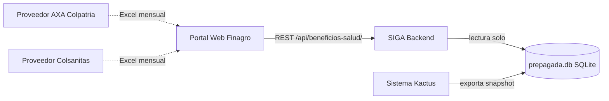

# Integraciones

| Campo        | Valor                                                          |
|--------------|----------------------------------------------------------------|
| Versión      | 1.0                                                            |
| Fecha        | 2026-05-13                                                     |
| Fuente       | Arquitectura §3.5, §7; Documentación Técnica §10                |
| Responsable  | Equipo SIGA / DevOps                                           |
| Estado       | Borrador                                                       |

---

## 1. Mapa de integraciones

## 2. Catálogo de integraciones

| ID    | Sistema externo               | Dirección  | Naturaleza        | Frecuencia        | Mecanismo                                |
|-------|--------------------------------|------------|--------------------|-------------------|-------------------------------------------|
| INT-1 | Portal web Finagro             | Entrante   | REST sobre HTTP    | Bajo demanda      | API DRF en `/api/beneficios-salud/`        |
| INT-2 | Proveedor AXA Colpatria        | Entrante   | Archivo (Excel)   | Mensual           | Manual: analista descarga del correo y carga |
| INT-3 | Proveedor Colsanitas           | Entrante   | Archivo (Excel)   | Mensual           | Manual: analista descarga del correo y carga |
| INT-4 | `prepagada.db` (Kactus)        | Entrante   | SQLite + vistas    | Periódica (Kactus)| Lectura directa del archivo en `PREPAGADA_DB_PATH` |

## 3. INT-1 — API REST (consumida por el portal)

- **Base URL:** `/api/beneficios-salud/`
- **Autenticación:** `SessionAuthentication` y `BasicAuthentication` configuradas en DRF. Permisos por defecto: `AllowAny`.
- **Formato:** JSON (excepto exportaciones, que retornan Excel binario).
- **Contrato detallado:** ver [`../03-tecnico/api.md`](../03-tecnico/api.md).

> ⚠️ PENDIENTE: el repositorio del portal web, los esquemas exactos request/response y el equipo responsable del portal no se documentan en las fuentes. Falta también la política de versionado del API.

## 4. INT-2 / INT-3 — Archivos de proveedores

| Aspecto                   | AXA Colpatria                                                 | Colsanitas                                                          |
|---------------------------|----------------------------------------------------------------|---------------------------------------------------------------------|
| Formato                   | Excel `.xlsx`                                                  | Excel `.xls` o `.xlsx`                                              |
| Columnas características   | `SUB CTO`, `NUMID`, `NUMERO ID.BEN`, `NOMBRE`, `PARENTESCO`, `SUBTOTAL`, `IVA`, `TOTAL` | `Numero de Familia`, `Numero de Documento`, `Apellidos`, `Nombres`, `Cuota`, `Descuento Comercial`, `IVA`, `Total Us` / `Total` |
| Mecanismo de detección     | Nombre contiene `AXA`; o columnas `SUB CTO` + `NUMID`           | Nombre contiene `COLSANITAS`; o columna `Numero de Familia`         |
| Particularidades           | No trae `descuento` separado (SIGA lo registra como 0)         | Trae filas resumen que SIGA filtra; admite descuento negativo en ajustes |

> ⚠️ PENDIENTE: SLA con cada proveedor (fecha mensual prometida, contacto para reclamaciones, contrato vigente). No documentado.

## 5. INT-4 — `prepagada.db` (Kactus)

| Aspecto                | Valor                                                                    |
|-------------------------|--------------------------------------------------------------------------|
| Tecnología              | SQLite                                                                    |
| Ruta                    | `PREPAGADA_DB_PATH` (por defecto `backend/db/prepagada.db`)               |
| Acceso                  | Sólo lectura desde `services/prepagada_service.py`                         |
| Objetos consumidos      | `facturas_eps`, `empleados_kactus`, `v_cruce`                              |
| Campos consumidos de `v_cruce` | `periodo, eps, cedula, nombre_en_factura, nombre_en_kactus, num_beneficiarios, total_familia, sub_cto, nro_cont, sue_basi, tip_cont, estado, archivo` |
| Comportamiento ante ausencia | Endpoints de cruce y planilla retornan error (HTTP 503 según T1 §14 / HTTP 500 según F2). El resto del módulo opera normalmente. |

> ⚠️ PENDIENTE: el proceso por el que `prepagada.db` es generado desde Kactus, su frecuencia y el equipo responsable no figuran en las fuentes. Es la dependencia runtime más crítica del módulo de medicina prepagada.

## 6. Volúmenes y rutas de filesystem

| Recurso             | Ruta dentro del contenedor                  | Volumen docker-compose                  |
|---------------------|----------------------------------------------|------------------------------------------|
| Storage de archivos | `/app/../storage`                             | `./storage:/app/../storage`               |
| Bases de datos       | `/app/db`                                     | `siga_db:/app/db`                          |

## 7. Roadmap de integraciones (no implementadas)

| Integración futura                                           | Origen del requerimiento              |
|---------------------------------------------------------------|----------------------------------------|
| Sincronización automática Kactus → `prepagada.db`            | Detectada como gap operativo            |
| Recepción automatizada de Excel desde el correo del proveedor | Hoy es manual                           |
| Servicio de autenticación corporativa (SSO/OIDC)             | Hoy DRF está en `AllowAny`              |
| Notificaciones (email/Slack) ante archivo en `ERROR`         | No documentado                          |
| Exposición de métricas a un sistema de monitoreo              | No documentado (ver `04-operacion/monitoreo-y-alertas.md`) |

---

**Fuente:** `siga/ARQUITECTURA_SOFTWARE.md` (§3.5 Almacenamiento, §7 Datos, §9 Seguridad), `siga/DOCUMENTACION_TECNICA.md` (§4 Configuración, §10 Servicio prepagada).
