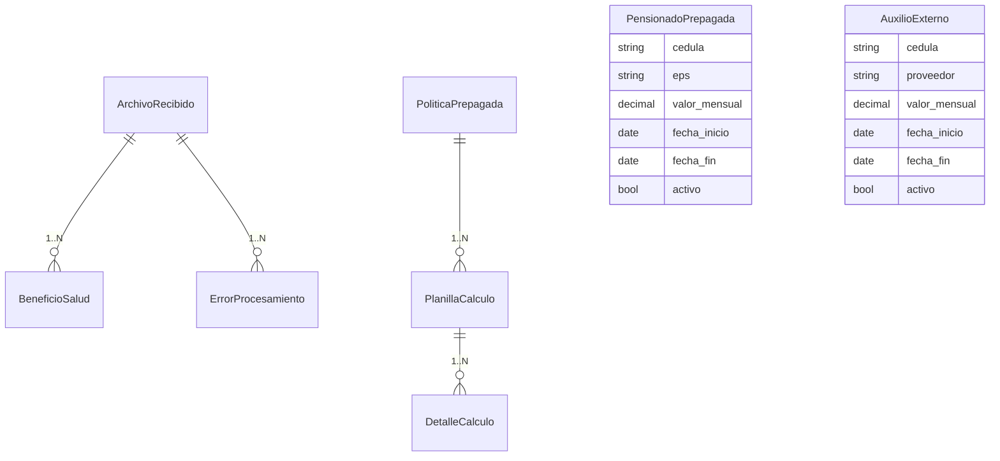

# Modelo de Datos

| Campo        | Valor                                                                       |
|--------------|------------------------------------------------------------------------------|
| Versión      | 1.0                                                                          |
| Fecha        | 2026-05-13                                                                   |
| Fuente       | Documentación Técnica §5; Documento Funcional Beneficios de Salud (Modelos)   |
| Responsable  | Líder técnico SIGA                                                            |
| Estado       | Borrador                                                                     |

---

## 1. Vista global de entidades



## 2. Tablas ETL (beneficios de salud)

| Modelo                | Tabla                          | Propósito                                                                       |
|-----------------------|--------------------------------|---------------------------------------------------------------------------------|
| `ArchivoRecibido`     | `bs_archivos_recibidos`        | Control de archivos cargados: estado, hash, contrato, periodo y contadores.     |
| `BeneficioSalud`      | `bs_beneficios_salud`          | Registros normalizados por beneficiario.                                          |
| `ErrorProcesamiento`  | `bs_errores_procesamiento`     | Errores y advertencias por fila de origen.                                       |

### 2.1 `BeneficioSalud` — modelo central

| Campo                  | Tipo                | Descripción                                                |
|------------------------|---------------------|-------------------------------------------------------------|
| `archivo`              | FK → `ArchivoRecibido` | Archivo de origen del registro.                              |
| `cedula`               | CharField           | Cédula del beneficiario.                                     |
| `cedula_titular`       | CharField           | Cédula del titular del contrato (solo AXA).                  |
| `nombre`               | CharField           | Nombre completo del beneficiario.                             |
| `parentesco`           | CharField           | Relación con el titular (TITULAR, CÓNYUGE, HIJO, etc.).      |
| `sub_contrato`         | CharField           | Código de sub-contrato / núcleo familiar.                     |
| `proveedor`            | CharField           | `axa_colpatria` o `colsanitas`.                                |
| `tipo_plan`            | CharField           | Nombre del plan de salud.                                     |
| `valor_base`           | DecimalField        | Subtotal antes de descuentos e IVA.                            |
| `descuento`            | DecimalField        | Descuento comercial aplicado.                                  |
| `iva`                  | DecimalField        | IVA del servicio.                                              |
| `valor_total`          | DecimalField        | Valor final a pagar.                                            |
| `estado_validacion`    | CharField           | `OK`, `ADVERTENCIA` o `ERROR`.                                  |
| `fecha_nacimiento`     | DateField           | Fecha de nacimiento del beneficiario (si aplica).               |
| `fecha_corte`          | DateField           | Fecha de corte del periodo.                                     |
| `fecha_procesamiento`  | DateTimeField       | Timestamp de procesamiento en el sistema.                       |

### 2.2 `ArchivoRecibido`

| Campo                    | Tipo                | Descripción                                                       |
|--------------------------|---------------------|--------------------------------------------------------------------|
| `proveedor`              | CharField           | Proveedor detectado.                                              |
| `nombre_archivo`         | CharField           | Nombre original del archivo.                                       |
| `ruta_archivo`           | CharField           | Ruta en disco (auditoría).                                         |
| `hash_sha256`            | CharField           | Huella SHA256 del archivo (deduplicación).                          |
| `estado_procesamiento`   | CharField           | `RECIBIDO` → `PROCESANDO` → `PROCESADO` / `ERROR`.                  |
| `total_registros`        | IntegerField        | Filas leídas del Excel.                                            |
| `registros_procesados`   | IntegerField        | Filas insertadas exitosamente.                                     |
| `registros_con_error`    | IntegerField        | Filas rechazadas.                                                  |
| `numero_contrato`        | CharField           | Extraído del Excel.                                                |
| `periodo_facturacion`    | CharField           | Periodo `MMYYYY`.                                                  |
| `usuario_carga`          | CharField           | Usuario que realizó la carga.                                       |
| `fecha_carga`            | DateTimeField       | Timestamp de carga.                                                 |

### 2.3 `ErrorProcesamiento`

| Campo            | Tipo                | Descripción                                                  |
|------------------|---------------------|---------------------------------------------------------------|
| `archivo`        | FK → `ArchivoRecibido` | Archivo origen.                                              |
| `fila_origen`    | IntegerField        | Número de fila en el Excel original (1-based).                |
| `tipo_error`     | CharField           | Ej.: `CEDULA_INVALIDA`, `VALOR_INVALIDO`, `CEDULA_DUPLICADA`. |
| `descripcion`    | TextField           | Descripción legible del problema.                              |
| `datos_fila`     | JSONField           | Snapshot de la fila con el problema.                            |
| `timestamp`       | DateTimeField       | Momento del registro del error.                                  |

## 3. Tablas de medicina prepagada

| Modelo                | Tabla                          | Propósito                                                              |
|-----------------------|--------------------------------|-------------------------------------------------------------------------|
| `PoliticaPrepagada`   | `bs_politica_prepagada`        | Parámetros del cálculo 80/20 y UVT.                                     |
| `PensionadoPrepagada` | `bs_pensionados_prepagada`     | Pensionados activos con pago 100 %.                                     |
| `AuxilioExterno`      | `bs_auxilio_externo`           | Auxilios externos activos para informe EFR.                              |
| `PlanillaCalculo`     | `bs_planilla_calculo`          | Cabecera de planilla calculada por periodo.                              |
| `DetalleCalculo`      | `bs_detalle_calculo`           | Resultado por cédula/EPS de la planilla.                                  |

### 3.1 `PoliticaPrepagada`

| Campo                          | Tipo            | Descripción                                                |
|--------------------------------|-----------------|-------------------------------------------------------------|
| `porcentaje_empresa`           | DecimalField    | % que asume Finagro (típico 80).                            |
| `porcentaje_empleado`          | DecimalField    | % que asume el colaborador (típico 20).                     |
| `uvt_limite`                   | IntegerField    | Número de UVT no gravables (típico 16).                     |
| `valor_uvt`                    | DecimalField    | Valor en COP de 1 UVT en el año vigente.                    |
| `cod_conc_apoyo_no_grav`       | CharField       | Código contable del apoyo no gravable.                       |
| `cod_conc_apoyo_grav`          | CharField       | Código contable del apoyo gravable.                          |
| `cod_conc_dcto_empleado`       | CharField       | Código contable del descuento al empleado.                   |
| `porcentaje_empresa_pensionado`| DecimalField    | % para pensionados si difiere del general.                   |
| `notas`                        | TextField       | Fundamento de la política.                                    |
| `vigente_desde`                | DateField       | Fecha a partir de la cual aplica.                             |

### 3.2 `PlanillaCalculo` y `DetalleCalculo`

`PlanillaCalculo` es la cabecera por periodo (campos típicos: `periodo`, `politica`, totales empresa/empleado, gravable/no gravable, `generada_por`, `generada_en`). `DetalleCalculo` guarda el resultado por cédula con `valor_empresa`, `valor_empleado`, `apoyo_no_gravable`, `apoyo_gravable` y `estado_elegibilidad` (`ELEGIBLE_80_20`, `PENSIONADO_100`, `BLOQUEADO_CRUCE`).

> ⚠️ PENDIENTE: las fuentes no listan campo por campo de `PlanillaCalculo` ni `DetalleCalculo`. La inferencia anterior viene del flujo descrito en T1 §11 y F2 (Módulo Prepagada).

### 3.3 `PensionadoPrepagada` y `AuxilioExterno`

| Campo            | Tipo            | Descripción                              |
|------------------|-----------------|------------------------------------------|
| `cedula`         | CharField       | Documento del pensionado/empleado.       |
| `nombre`         | CharField       | Nombre completo.                          |
| `eps` / `proveedor` | CharField     | Proveedor del beneficio.                  |
| `valor_mensual`  | DecimalField    | Valor de cuota familiar.                   |
| `fecha_inicio`   | DateField       | Inicio del beneficio.                       |
| `fecha_fin`      | DateField       | Terminación (opcional).                     |
| `activo`         | BooleanField    | Vigencia del beneficio.                     |
| `observaciones`  | TextField       | Notas adicionales.                          |

## 4. Base externa `prepagada.db`

| Objeto              | Uso                                                          |
|---------------------|---------------------------------------------------------------|
| `facturas_eps`       | Periodos disponibles y datos facturados.                       |
| `empleados_kactus`   | Datos laborales para cruces auxiliares.                        |
| `v_cruce`           | Vista que cruza factura ↔ Kactus por periodo.                   |

Campos consumidos de `v_cruce` por `prepagada_service.py`:

```text
periodo, eps, cedula, nombre_en_factura, nombre_en_kactus,
num_beneficiarios, total_familia, sub_cto, nro_cont,
sue_basi, tip_cont, estado, archivo
```

## 5. Migraciones

| Tema                                  | Estado documentado |
|---------------------------------------|---------------------|
| Convención de Django                  | Migraciones bajo `backend/modules/beneficios_salud/migrations/`. |
| Política de versionado de migraciones | `PENDIENTE` |
| Política de hotfix / rollback         | `PENDIENTE` |
| Comando estándar                      | `python manage.py migrate` (ver `04-operacion/despliegue.md`). |

## 6. Datos sensibles

Las siguientes columnas contienen información personal y deben tratarse bajo Ley 1581 (ver [`../05-seguridad/manejo-de-datos-sensibles.md`](../05-seguridad/manejo-de-datos-sensibles.md)):

- `BeneficioSalud.cedula`, `cedula_titular`, `nombre`, `parentesco`, `fecha_nacimiento`.
- `PensionadoPrepagada.cedula`, `nombre`.
- `AuxilioExterno.cedula`, `nombre`.
- `ErrorProcesamiento.datos_fila` (puede incluir información personal serializada).
- Datos de `prepagada.db`: `cedula`, `nombre_en_factura`, `nombre_en_kactus`, `sue_basi`.

---

**Fuente:** `siga/DOCUMENTACION_TECNICA.md` (§5 Modelo de datos, §10 Servicio prepagada, §11 Elegibilidad), `siga/DOCUMENTO_FUNCIONAL_BENEFICIOS_SALUD.md` (Modelos de Datos, Indicadores Operativos), `siga/ARQUITECTURA_SOFTWARE.md` (§7 Vista de datos).
