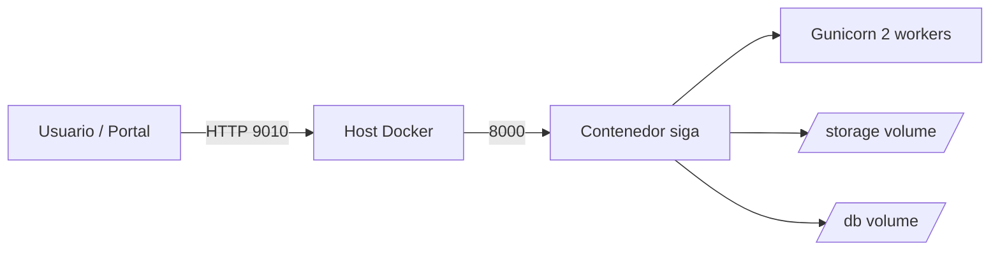

# Despliegue

| Campo        | Valor                                                |
|--------------|-------------------------------------------------------|
| Versión      | 1.0                                                   |
| Fecha        | 2026-05-13                                            |
| Fuente       | Documentación Técnica §13; README de SIGA              |
| Responsable  | DevOps / Líder técnico                                 |
| Estado       | Borrador                                              |

---

## 1. Modelo de despliegue actual

SIGA se despliega como un único contenedor Docker basado en `python:3.11-slim`, ejecutando Gunicorn como servidor WSGI con dos workers.



## 2. Dockerfile

```dockerfile
FROM python:3.11-slim
WORKDIR /app
COPY backend/requirements.txt .
RUN pip install --no-cache-dir -r requirements.txt
COPY backend/ .
RUN mkdir -p /app/db
EXPOSE 8000
CMD ["gunicorn", "core.wsgi:application", "--bind", "0.0.0.0:8000", "--workers", "2"]
```

## 3. Docker Compose

| Aspecto                | Valor                                  |
|------------------------|----------------------------------------|
| Servicio                | `siga`                                  |
| Puerto host             | 9010                                    |
| Puerto contenedor       | 8000                                    |
| Volumen archivos         | `./storage:/app/../storage`              |
| Volumen BD               | `siga_db:/app/db`                        |
| Variable de entorno     | `PREPAGADA_DB_PATH=/app/db/prepagada.db` |

## 4. Procedimiento de despliegue (alto nivel)

> ℹ️ Los comandos a continuación provienen del `README.md` del repositorio.

### 4.1 Docker

```bash
cd ~/Finagro/siga
docker compose up --build -d

# Migraciones
docker compose exec siga python manage.py migrate

# Crear superusuario (opcional)
docker compose exec siga python manage.py createsuperuser
```

### 4.2 Local (desarrollo)

```bash
cd ~/Finagro/siga/backend
pip install -r requirements.txt
mkdir -p db
python manage.py migrate
python manage.py runserver 0.0.0.0:9010
```

## 5. Verificación post-despliegue

1. Acceder a `http://<host>:9010/admin/` — el admin Django debe responder.
2. Ejecutar `GET /api/beneficios-salud/archivos/` — debe retornar 200 (con lista vacía si no hay archivos).
3. Si el módulo de prepagada está habilitado, ejecutar `GET /api/beneficios-salud/cruce/` para validar la conexión a `prepagada.db`. Si el archivo no existe, el endpoint retornará 503/500 (ver T1 §14 / F2).

## 6. Migraciones

| Acción                                  | Comando                                        |
|-----------------------------------------|------------------------------------------------|
| Aplicar migraciones                      | `python manage.py migrate`                      |
| Crear nueva migración                    | `python manage.py makemigrations beneficios_salud` |
| Listar migraciones aplicadas              | `python manage.py showmigrations`               |

> ⚠️ PENDIENTE: política de rollback de migraciones no documentada.

## 7. Backups

> ⚠️ PENDIENTE: estrategia de backup no documentada. La Arquitectura §9 recomienda proteger `storage/landing` y `prepagada.db` con backups y permisos del sistema.

Recomendación mínima:

| Recurso                  | Frecuencia          | Retención        |
|--------------------------|---------------------|-------------------|
| Base de datos principal   | Diaria               | `PENDIENTE`       |
| `prepagada.db`            | Por sincronización Kactus | `PENDIENTE` |
| `storage/landing/`        | Diaria o semanal     | `PENDIENTE`       |
| Configuración (.env)      | En vault             | `PENDIENTE`       |

## 8. CI/CD

> ⚠️ PENDIENTE: pipeline de CI/CD no documentado. Definir:
> - Pipeline para ejecutar tests al PR.
> - Build de imagen Docker etiquetada por release.
> - Promoción Dev → QA → Prod (manual o automática, aprobaciones).
> - Auditoría de cambios en `prepagada.db` y migraciones de BD.

## 9. Rollback

> ⚠️ PENDIENTE: procedimiento de rollback no documentado. A nivel código, el rollback ideal es desplegar la imagen Docker anterior. Para migraciones de BD se requiere migración reversa explícita (`python manage.py migrate beneficios_salud <numero_anterior>`).

---

**Fuente:** `siga/DOCUMENTACION_TECNICA.md` (§13 Despliegue), `siga/ARQUITECTURA_SOFTWARE.md` (§6 Vista de despliegue, §9 Seguridad), `siga/README.md`.
