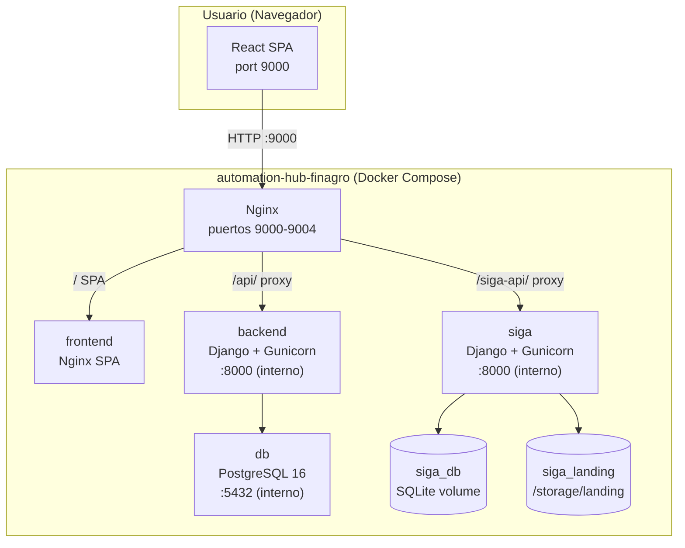
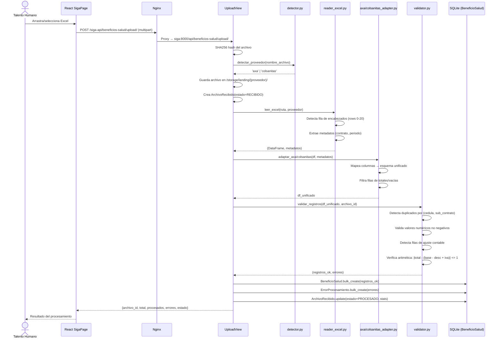
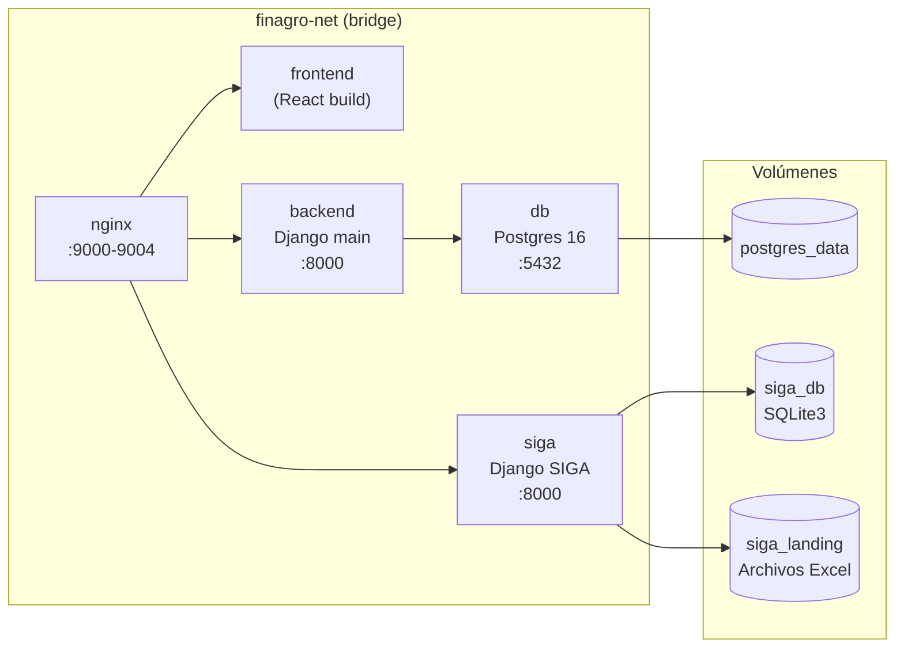
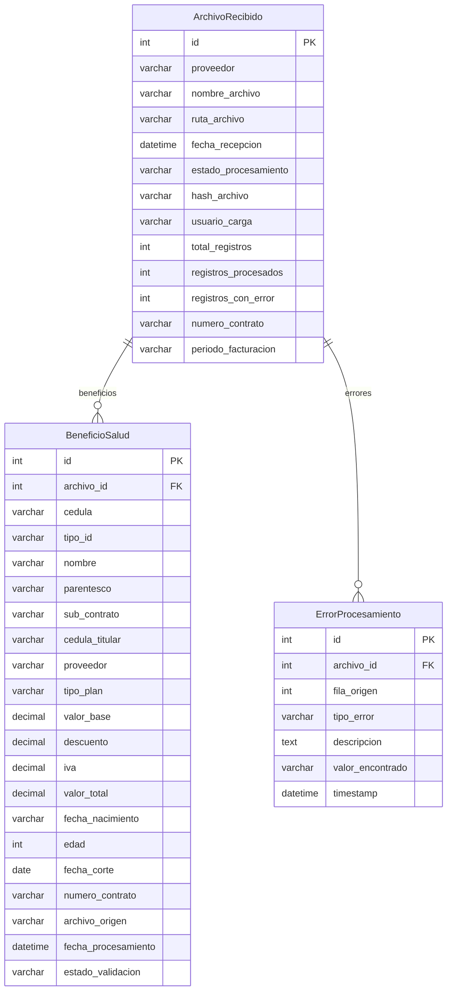
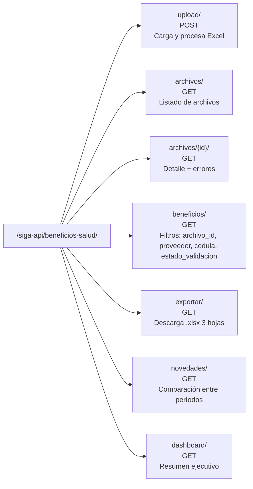

# SIGA — Arquitectura Actual

> Estado: Producción — Marzo 2026

---

## Visión general



---

## Flujo de carga de archivo Excel



---

## Estructura de contenedores



---

## Modelo de datos



---

## Mapa de rutas API



---

## Pipeline ETL interno

```mermaid
flowchart TD
    A[Archivo Excel recibido] --> B{Detectar proveedor}
    B -->|nombre contiene AXA| C[reader_excel: _leer_axa\nopenpyxl, header rows 0-15]
    B -->|nombre contiene COLSANITAS| D[reader_excel: _leer_colsanitas\nxlrd/.xls · openpyxl/.xlsx\nheader rows 0-20]
    B -->|desconocido| E[Fallback openpyxl header=0]

    C --> F[adaptar_axa\nMapeo: NUMID→cedula_titular\nNUMERO ID.BEN→cedula\nSUBTOTAL→valor_base]
    D --> G[adaptar_colsanitas\nFiltro filas TOTAL FAMILIA\nCuota→valor_base\nDescuento Comercial→descuento]
    E --> H[Sin adaptador específico]

    F --> I[validar_registros]
    G --> I
    H --> I

    I --> J{cedula vacía?}
    J -->|Sí| K[ErrorProcesamiento\nCEDULA_INVALIDA]
    J -->|No| L{valor base/iva/total < 0?}
    L -->|Sí y no es fila ajuste| M[ErrorProcesamiento\nVALOR_INVALIDO]
    L -->|No o fila ajuste| N{(cedula,sub_contrato)\nduplicado?}
    N -->|Sí| O[BeneficioSalud\nestado=ADVERTENCIA\n+ ErrorProcesamiento\nCEDULA_DUPLICADA]
    N -->|No| P{|total - base+desc-iva| > 1?}
    P -->|Sí| Q[BeneficioSalud\nestado=ADVERTENCIA]
    P -->|No| R[BeneficioSalud\nestado=OK]
```

---

## Stack tecnológico

| Capa | Tecnología |
|------|-----------|
| Backend SIGA | Django 4.2 + Django REST Framework |
| ORM / BD | Django ORM + SQLite 3 (volumen Docker) |
| ETL | Pandas + openpyxl + xlrd |
| Exportación | openpyxl (escritura .xlsx con estilos) |
| Servidor WSGI | Gunicorn |
| Proxy inverso | Nginx |
| Contenedores | Docker + Docker Compose |
| Frontend | React 18 (SPA, hooks, fetch API) |
| Red Docker | finagro-net (bridge) |
