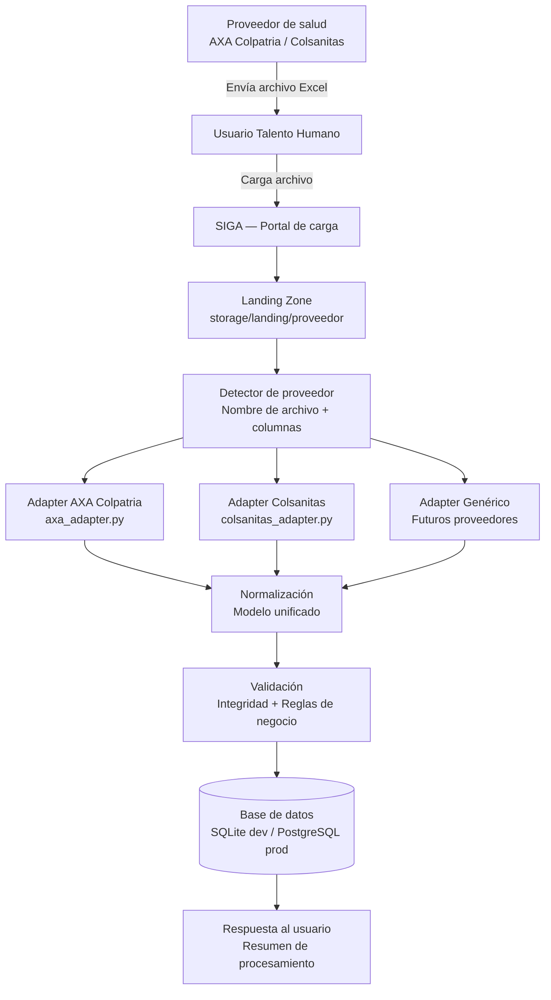
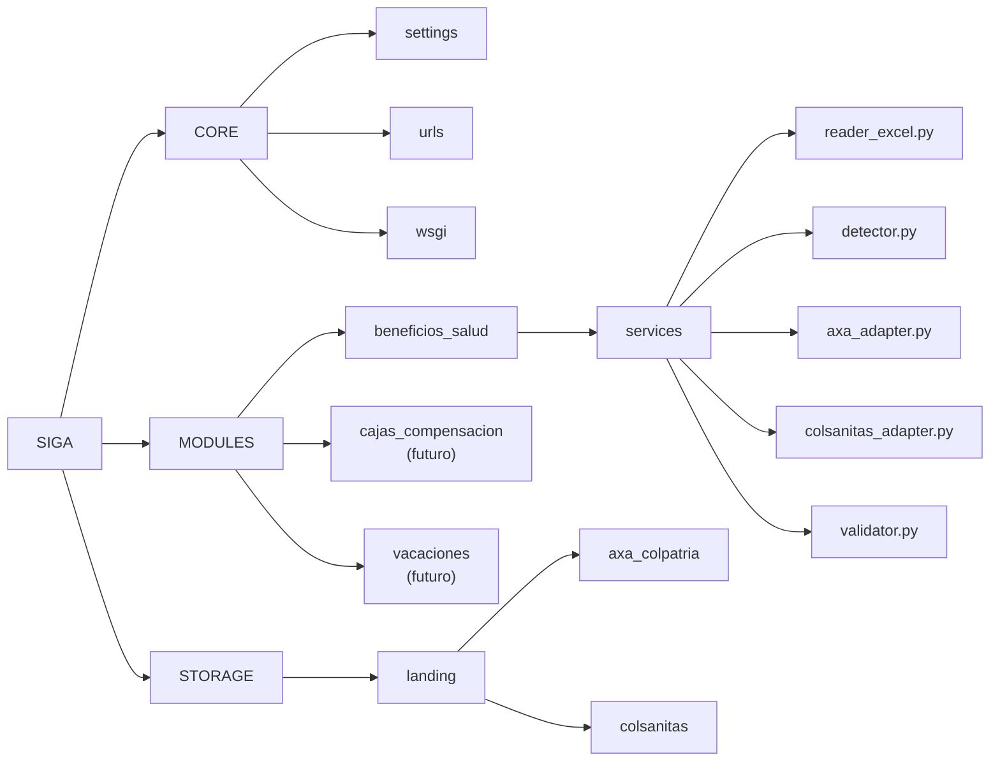
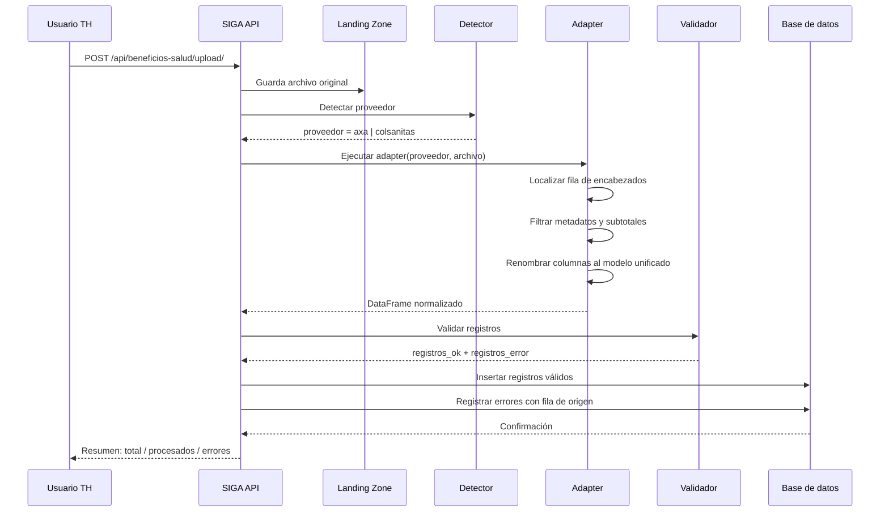
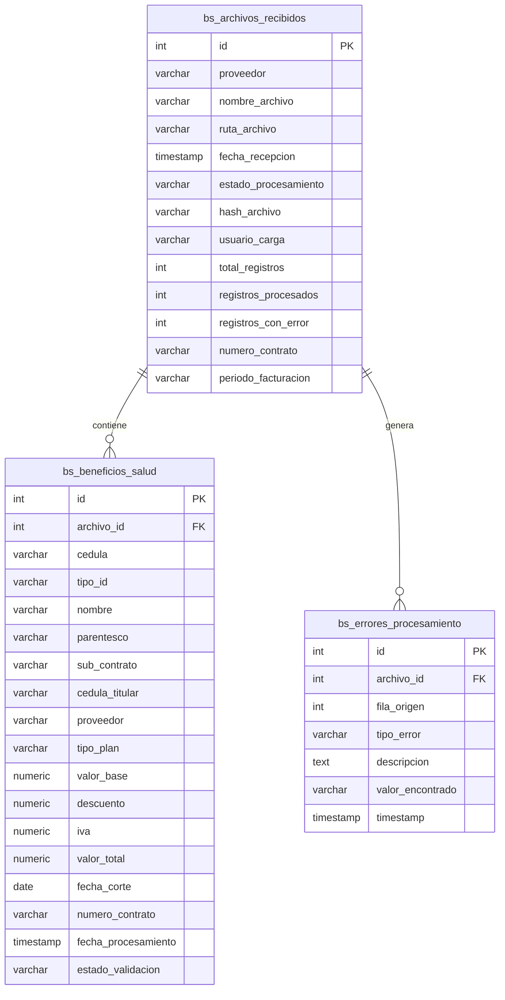
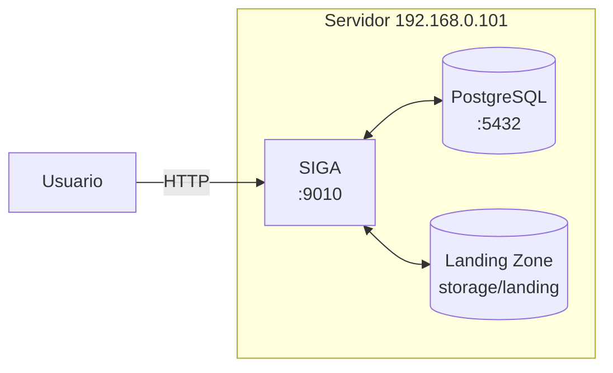

# Arquitectura SIGA
## Sistema Inteligente de Gestión Administrativa

**Versión:** 1.0 — Borrador inicial, sujeto a cambios  
**Fecha:** Marzo 2026

---

## 1. Arquitectura general del sistema

---

## 2. Arquitectura modular — SIGA como plataforma

---

## 3. Flujo ETL — Módulo Beneficios de Salud

---

## 4. Estructura de la base de datos

---

## 5. Infraestructura de despliegue

