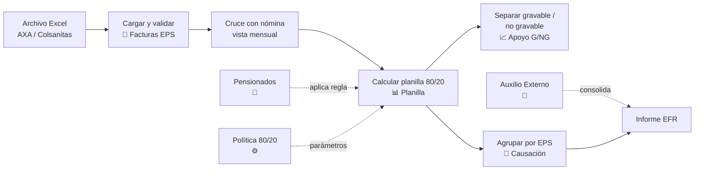

# Beneficios de Salud — Lógica de Negocio

| Campo      | Valor                                                                 |
|------------|-----------------------------------------------------------------------|
| Versión    | 1.0                                                                   |
| Fecha      | 2026-05-14                                                            |
| Audiencia  | Equipo de Talento Humano — Finagro                                    |
| Propósito  | Presentar y validar la lógica funcional del módulo                    |
| Insumos    | Verificación directa del comportamiento de los 8 sub-módulos          |

---

## 1. ¿Qué resuelve este módulo?

Cada mes, Finagro recibe facturas de las aseguradoras de medicina prepagada (AXA Colpatria y Colsanitas) con el cobro consolidado por grupo familiar de cada empleado afiliado. **Beneficios de Salud** es el módulo que toma esas facturas, las cruza con la nómina vigente y produce todo lo que el área operativa necesita para liquidar el beneficio del mes: cuánto asume la empresa, cuánto descuenta al empleado, cuánto entra como apoyo no gravable, cuánto pasa a apoyo gravable y cómo se contabiliza por aseguradora.

Sobre ese flujo central se apoyan tres listados de gestión: pensionados que reciben tratamiento 100% empleado, empleados con póliza externa que reciben auxilio de Finagro, y la política institucional que define los porcentajes y los topes vigentes. Todo el ciclo queda trazado: cada planilla calculada conserva la política con la que se liquidó y el detalle persona-a-persona del cálculo aplicado.

El objetivo de la presentación de hoy es **validar con TH** que las reglas operativas implementadas reflejan el manual THU-DOC-002 §10.4–10.6, y dejar claras las definiciones funcionales pendientes para cerrar el alcance.

---

## 2. Mapa general del proceso

El flujo es lineal y se ejecuta una vez por período. Pensionados, política y auxilio externo son configuraciones que alimentan al cálculo y al consolidado mensual.

---

## 3. Los 8 módulos

### 3.1 Dashboard

**¿Qué hace?**
Es la vista de entrada al módulo. Resume en una pantalla el estado de la operación del mes: cuántos archivos se han recibido, cuántos beneficiarios fueron procesados, qué proveedores están activos y cómo se distribuye el costo del último período.

**¿Quién lo usa?**
Analista de Gestión Humana al inicio de cada jornada operativa. Sirve para ver "cómo va el mes" sin entrar a los reportes detallados.

**Cómo funciona en la operación**
1. TH ingresa al módulo Beneficios de Salud y aterriza en el Dashboard por defecto.
2. La pantalla muestra tres contadores grandes: archivos cargados, registros procesados y proveedores activos.
3. Debajo, 4 KPIs operativos: archivos recibidos, beneficiarios totales, registros con error y proveedores activos.
4. Una tarjeta por aseguradora muestra el resumen del último período recibido.
5. Una vista por distribución de parentesco permite identificar la composición familiar del beneficio.

**Reglas que aplica**
No aplica reglas de negocio: es 100% una vista de consulta consolidada.

**Lo que ya entrega**
- Vista única de "estado del mes" sin necesidad de abrir reportes específicos.
- Conteo por proveedor con el último período disponible.
- Distribución de parentesco para el último archivo procesado.
- Valor consolidado por aseguradora.

**Lo que está en evolución**
- La columna de parentesco aparece como "Sin especificar" para Colsanitas; el mapeo de esa columna desde el archivo está en evolución.

---

### 3.2 Facturas EPS

**¿Qué hace?**
Es la entrada del proceso. Aquí TH carga el archivo Excel mensual que llega de la aseguradora (AXA Colpatria o Colsanitas), el sistema lo valida fila por fila y persiste cada beneficiario con trazabilidad del origen. Una vez cargado, el archivo queda disponible para los demás módulos del flujo (planilla, causación, conciliación) y se conserva como evidencia auditable.

**¿Quién lo usa?**
Analista de Gestión Humana — recibe el archivo del proveedor, lo carga y verifica que haya sido procesado correctamente antes de iniciar el cálculo del mes.

**Cómo funciona en la operación**
1. TH descarga el Excel del portal del proveedor (AXA o Colsanitas).
2. Sube el archivo desde la pestaña "Facturas EPS".
3. El sistema detecta automáticamente el proveedor (por nombre del archivo y por estructura de columnas).
4. Cada fila se valida y queda registrada como "OK", "Advertencia" (ej: cédula duplicada en el mismo grupo familiar) o "Error" (la fila no entra al cálculo).
5. TH ve el resultado: total de registros procesados, registros con error, advertencias por revisar.
6. El archivo y sus filas quedan disponibles en el historial, indexados por proveedor y período.

**Reglas que aplica**

| Regla | Descripción | Estado |
|---|---|---|
| Validación de cédula presente | Toda fila debe tener cédula no vacía | ✅ |
| Validación de valores numéricos | Valor base, descuento, IVA y total deben ser numéricos válidos | ✅ |
| Sin negativos | Los valores facturados no pueden ser negativos | ✅ |
| Consistencia aritmética | `valor_base − descuento + iva ≈ valor_total` (tolerancia ±$1) | ✅ |

**Lo que ya entrega**
- Detección automática del proveedor.
- Validación de las 4 reglas de calidad de datos.
- Historial completo de cargas, con detalle de errores por fila.
- Consulta global por cédula a través de todos los archivos.
- Comparación entre dos archivos: nuevos, retirados, cambios de valor.
- Exportación a Excel con un consolidado y una hoja por proveedor.
- Conservación del archivo físico original y de su huella digital (hash SHA256).

**Lo que está en evolución**
- Exportación a Excel se está afinando para entregar formato unificado consumible por contabilidad.

---

### 3.3 Planilla 80/20

**¿Qué hace?**
Es el cálculo central del módulo. Toma las facturas del mes y las cruza con la nómina vigente (vista construida desde Kactus), aplica la distribución 80/20 — la empresa asume el 80%, el empleado el 20% — y entrega una planilla persona por persona con el aporte de empresa, el aporte de empleado, el apoyo no gravable, el apoyo gravable y el estado del cruce.

Cada planilla queda persistida con la política vigente al momento del cálculo, de modo que el detalle persona-a-persona es reproducible y auditable hacia atrás.

**¿Quién lo usa?**
Analista de Gestión Humana ejecuta el cálculo una vez al mes una vez verificadas las facturas. Tributaria y Contabilidad consumen el resultado.

**Cómo funciona en la operación**
1. TH selecciona el período (formato MMYYYY) y ejecuta "Calcular planilla".
2. El sistema lee el cruce mensual (cédulas de las facturas + estado en nómina) y aplica:
   - **Empleado activo en nómina (cruce OK):** distribución 80/20 sobre el total familiar.
   - **Pensionado activo registrado:** 100% empleado (regla MP-006).
   - **No encontrado o inactivo en nómina:** queda bloqueado, no genera aporte empresa.
3. Sobre el aporte de empresa de cada elegible, el sistema separa la parte no gravable (hasta 16 UVT × valor UVT) y el exceso como apoyo gravable.
4. La planilla queda guardada con su política aplicada, totales y detalle por cédula.
5. TH puede exportar a Excel con dos hojas: planilla completa y apoyo gravable.
6. Bloqueados se conservan en el detalle para que TH los gestione operativamente.

**Reglas que aplica**

| Regla | Descripción | Estado |
|---|---|---|
| MP-005 | Distribución 80% empresa / 20% empleado sobre el total familiar | ✅ |
| MP-006 | Pensionado activo asume el 100% del valor (no recibe aporte empresa) | ✅ |
| MP-028 | Empleado no encontrado en nómina queda bloqueado, sin aporte empresa | ✅ |
| MP-029 | Empleado inactivo en nómina queda bloqueado | ✅ |
| MP-030 | El registro bloqueado se conserva en el detalle para gestión operativa | ✅ |
| MP-031 | El cálculo se aplica al grupo familiar consolidado | ✅ |
| MP-033 | Separación de apoyo no gravable (hasta 16 UVT) y apoyo gravable | ✅ |
| MP-041 | Cada planilla queda asociada a la política con la que se calculó | ✅ |
| MP-002..004 | Antigüedad mínima, periodo de prueba, autorización de descuento | 🔵 |
| MP-008..017 | Reglas de elegibilidad de beneficiarios (cónyuge, hijos, edad, dependencia) | 🔵 |
| MP-026, MP-027 | Prorrateo por días laborados en ingreso/retiro | 🔵 |
| MP-016 | Familiares no descritos asumen el costo total | 🔵 |
| MP-032 | Política vigente al período (mejora identificada) | 🟡 |

**Lo que ya entrega**
- Cálculo automático del 80/20 sobre el grupo familiar consolidado.
- Identificación de pensionados activos y aplicación del tratamiento 100%.
- Separación de gravable / no gravable según el límite UVT.
- Conservación del detalle por cédula con su motivo de elegibilidad.
- Exportación a Excel del mes calculado.
- Historial de planillas calculadas filtrable por período.
- Persistencia de la política aplicada para auditoría.

**Lo que está en evolución**
- Las reglas de elegibilidad detalladas del manual (antigüedad, edad de hijos, dependencia económica, etc.) están en roadmap.
- Prorrateos por ingreso/retiro a mitad de mes están en roadmap.
- Detección automática de pensionados desde la columna del archivo AXA está en evolución.

---

### 3.4 Apoyo Gravable / No Gravable

**¿Qué hace?**
Es la vista derivada de la planilla orientada al área tributaria. Muestra qué parte del aporte de empresa se reconoce como no gravable (hasta el tope de 16 UVT por empleado, exento de retención en la fuente) y qué parte supera el tope y queda como apoyo gravable (sí causa retención).

**¿Quién lo usa?**
Tributaria — para verificar la base de retención y los empleados que tuvieron exceso en el mes. TH la consulta como insumo para responder preguntas operativas de los empleados afectados.

**Cómo funciona en la operación**
1. TH selecciona la planilla del período de interés.
2. El módulo presenta un banner con la política aplicada: porcentajes, UVT × valor = límite no gravable.
3. KPIs principales: total apoyo no gravable, total apoyo gravable, total aporte empresa, número de empleados con exceso.
4. Tabla por empleado con desglose: aporte empresa, no gravable, gravable, valor del empleado, total grupo familiar.
5. Pensionados y bloqueados aparecen en la tabla con ceros en aporte empresa (por construcción).

**Reglas que aplica**

| Regla | Descripción | Estado |
|---|---|---|
| MP-033 | Tope de 16 UVT por empleado para apoyo no gravable | ✅ |
| MP-033 | Exceso sobre el tope se contabiliza como apoyo gravable | ✅ |

**Lo que ya entrega**
- Banner con la política con la que se liquidó la planilla (auditable hacia atrás).
- KPIs consolidados de gravable y no gravable.
- Tabla con el desglose por empleado.
- Identificación inmediata de los empleados con exceso del mes.
- Export Excel reutilizado desde la planilla (hoja "Apoyo Gravable").

**Lo que está en evolución**
- Visibilidad de la fecha de vigencia de la política en el banner está en evolución (el dato existe internamente).

---

### 3.5 Causación

**¿Qué hace?**
Es la vista orientada a Contabilidad. Toma la planilla calculada y agrupa los valores **por aseguradora (EPS)**, entregando los totales que se llevan al asiento contable mensual: número de empleados, total empresa, total empleado, apoyo no gravable y apoyo gravable por cada EPS.

Adicionalmente, ofrece una vista de **conciliación entre dos períodos** para identificar variaciones cédula por cédula: nuevos beneficiarios, retirados y cambios de valor en el aporte empresa.

**¿Quién lo usa?**
Contabilidad para producir el asiento contable mensual del beneficio. TH como apoyo cuando contabilidad necesita validación.

**Cómo funciona en la operación**
1. Contabilidad selecciona el período.
2. El módulo presenta una tabla agrupada por EPS con: empleados, total empresa, total empleado, no gravable, gravable.
3. Una fila TOTAL consolida los valores del período.
4. Vista hermana "Conciliación" permite comparar dos períodos cédula por cédula y reportar nuevos / retirados / cambios.

**Reglas que aplica**

| Regla | Descripción | Estado |
|---|---|---|
| Agrupado por EPS | Suma totales por aseguradora a partir de la planilla persistida | ✅ |
| Pensionados con cruce OK incluidos | Contribuyen a `total_empleado` por EPS | ✅ |
| Bloqueados excluidos | Cédulas con cruce ≠ OK no se contabilizan | ✅ |
| Conciliación entre períodos | Nuevos, retirados, cambios por cédula | ✅ |

**Lo que ya entrega**
- Agrupado por EPS con todos los conceptos del mes.
- Comparación entre dos períodos para reporte de variaciones.
- Idempotencia: los totales se leen de la planilla persistida, no se recalculan.

**Lo que está en evolución**
- Inclusión de los códigos contables (PUC) en el response: hoy los códigos viven en la Política 80/20 pero no se exponen en la vista de causación.
- Export propio de Causación (hoy se reutiliza el de planilla) está en roadmap.

---

### 3.6 Pensionados

**¿Qué hace?**
Es el listado maestro de personas que reciben tratamiento 100% empleado (regla MP-006 del manual). Cuando una cédula está activa en este listado, el motor de cálculo le aplica automáticamente 100% empleado en lugar de 80/20 — sin importar si esa persona aparece como activa o inactiva en la nómina, la regla del manual prevalece.

**¿Quién lo usa?**
Analista de Gestión Humana — registra altas, bajas y reactivaciones de pensionados.

**Cómo funciona en la operación**
1. TH abre la pestaña "Pensionados".
2. Para registrar un nuevo pensionado: cédula, nombre, EPS, valor mensual, fecha de inicio, vigencia, observaciones. Por defecto queda activo.
3. Si el pensionado deja de estarlo: TH abre el registro y desactiva la casilla.
4. Una vez activo, **al calcular la siguiente planilla**, esa cédula se identifica automáticamente y se le aplica 100% empleado, 0% empresa.
5. Las planillas históricas ya calculadas no cambian retroactivamente (los detalles quedan congelados en su momento).

**Reglas que aplica**

| Regla | Descripción | Estado |
|---|---|---|
| MP-006 | Pensionado asume el 100% del valor de la póliza colectiva | ✅ |

**Lo que ya entrega**
- Gestión completa: crear, editar, activar, desactivar, eliminar.
- Identificación automática al calcular la planilla.
- Conservación del histórico: los cálculos pasados no se alteran al modificar el listado.

**Lo que está en evolución**
- Sincronización automática con la columna del archivo AXA que marca pensionados está en evolución (hoy el registro es 100% manual).
- Carga masiva, adjuntos del acto administrativo, y historial de cambios están en roadmap.

---

### 3.7 Auxilio Externo

**¿Qué hace?**
Es el listado de empleados que tienen una póliza de medicina prepagada **externa** (es decir, no contratada por Finagro con AXA o Colsanitas — por ejemplo, Colmédica, Sura, Sanitas). El manual reconoce que Finagro puede reembolsar parcialmente el valor que paga el empleado, sujeto a topes y soportes.

Hoy el módulo permite **registrar** cada caso con sus datos básicos. El cálculo automático del auxilio (con su tope y validaciones) está en roadmap, una vez se cierre con TH la definición funcional del "promedio Finagro".

**¿Quién lo usa?**
Analista de Gestión Humana — registra los empleados aprobados para recibir auxilio externo.

**Cómo funciona en la operación**
1. TH abre la pestaña "Auxilio Externo".
2. Registra cada empleado autorizado: cédula, nombre, EPS externa, valor mensual, fecha de inicio, vigencia, observaciones.
3. El registro queda disponible en el listado y se consolida en el Informe EFR mensual.

**Reglas que aplica**

| Regla | Descripción | Estado |
|---|---|---|
| MP-019 | Auxilio = MIN(valor pagado por el empleado, promedio pólizas Finagro) | 🔵 |
| MP-020 | Certificación anual de la póliza externa | 🔵 |
| MP-021 | Recibos mensuales para verificar el pago | 🔵 |
| MP-022 | Retroactividad máxima de 3 meses | 🔵 |
| MP-023 | Tope: el auxilio nunca puede ser mayor a lo pagado | 🔵 |
| MP-024 | Cálculo del promedio de pólizas Finagro | 🔵 |
| MP-025 | Acto administrativo de autorización | 🔵 |

**Lo que ya entrega**
- Registro persistente del auxilio aprobado.
- Consolidado en el informe mensual EFR.

**Lo que está en evolución**
- Motor de cálculo automático (depende de definición funcional del "promedio Finagro").
- Adjuntos documentales: certificación anual, recibos mensuales, acto administrativo.

---

### 3.8 Política 80/20

**¿Qué hace?**
Es la configuración del sistema: porcentajes (80/20), valor UVT, tope UVT para apoyo no gravable, códigos contables (PUC) y fecha de vigencia. Cada planilla calculada queda asociada a la política con la que se liquidó, de manera que el detalle es reproducible hacia atrás aunque la política se actualice.

**¿Quién lo usa?**
Analista de Gestión Humana al inicio de cada año (o cuando cambie el UVT por decreto), en coordinación con contabilidad para los códigos contables.

**Cómo funciona en la operación**
1. TH abre la pestaña "Política 80/20".
2. Crea una nueva política con: porcentaje empresa, porcentaje empleado, UVT límite (16 por defecto), valor UVT del año, códigos contables, fecha de vigencia.
3. El sistema persiste la política y la pone disponible para el motor de cálculo.
4. La política con vigencia más reciente se aplica al calcular nuevas planillas.
5. Las planillas históricas quedan asociadas a su política original.

**Reglas que aplica**

| Regla | Descripción | Estado |
|---|---|---|
| MP-041 | Trazabilidad: cada planilla persiste con la política con la que se calculó | ✅ |
| Hoy vigente | 80/20, valor UVT $49.799, 16 UVT como límite no gravable, vigente desde 2026-01-01 | ✅ |
| MP-032 | El motor toma la política vigente al período (mejora identificada) | 🟡 |

**Lo que ya entrega**
- Gestión completa de políticas: crear, listar, editar.
- Asociación inmutable de cada planilla con su política original.
- Captura del usuario que creó la política.

**Lo que está en evolución**
- Validación de "política vigente al período" en lugar de "política más reciente".
- Visualización en pantalla de cuál política está activa hoy.

---

## 4. Reglas de negocio aplicadas

Resumen consolidado del cumplimiento del manual THU-DOC-002 §10.4–10.6:

| Regla   | Descripción                                                                         | Estado |
|---------|-------------------------------------------------------------------------------------|:------:|
| MP-005  | Distribución 80% empresa / 20% empleado sobre el total familiar                     | ✅      |
| MP-006  | Pensionado activo asume el 100% del valor                                            | ✅      |
| MP-028  | Empleado no encontrado en nómina queda bloqueado                                     | ✅      |
| MP-029  | Empleado inactivo en nómina queda bloqueado                                          | ✅      |
| MP-030  | El registro bloqueado se conserva en el detalle                                      | ✅      |
| MP-031  | El cálculo se aplica al grupo familiar consolidado                                   | ✅      |
| MP-033  | Separación de apoyo no gravable (hasta 16 UVT) y apoyo gravable                       | ✅      |
| MP-041  | Cada planilla queda asociada a la política con la que se calculó                     | ✅      |
| MP-032  | Política aplicada debe corresponder al período liquidado                              | 🟡     |
| MP-002  | Antigüedad mínima de 2 meses de vinculación                                           | 🔵     |
| MP-003  | Cumplimiento de periodo de prueba                                                     | 🔵     |
| MP-004  | Autorización por escrito para descuento por nómina                                    | 🔵     |
| MP-008  | Cónyuge / compañero permanente con unión ≥ 2 años                                     | 🔵     |
| MP-009  | Acreditación de estado civil                                                          | 🔵     |
| MP-010  | Hijos hasta 25 años con dependencia económica                                         | 🔵     |
| MP-011  | Hijos discapacitados de cualquier edad con certificado                                | 🔵     |
| MP-012  | Validación de edad de hijos                                                           | 🔵     |
| MP-013  | Validación de dependencia económica                                                   | 🔵     |
| MP-014  | Cobertura del padre / madre del titular                                               | 🔵     |
| MP-015  | Validación de parentesco contra reglas del manual                                     | 🔵     |
| MP-016  | Familiares no descritos asumen el costo total                                         | 🔵     |
| MP-017  | Aceptación expresa por parte del empleado                                             | 🔵     |
| MP-019  | Auxilio externo = MIN(valor pagado, promedio pólizas Finagro)                         | 🔵     |
| MP-020  | Certificación anual de póliza externa                                                 | 🔵     |
| MP-021  | Recibos mensuales del pago de la póliza externa                                       | 🔵     |
| MP-022  | Retroactividad máxima de 3 meses                                                      | 🔵     |
| MP-023  | Tope: auxilio nunca mayor a lo pagado                                                 | 🔵     |
| MP-024  | Cálculo del promedio de pólizas Finagro                                               | 🔵     |
| MP-025  | Acto administrativo de autorización del auxilio externo                                | 🔵     |
| MP-026  | Prorrateo por días laborados (ingreso a mitad de mes)                                 | 🔵     |
| MP-027  | Prorrateo por días laborados (retiro a mitad de mes)                                  | 🔵     |
| MP-042  | Control sobre el recálculo de planillas                                               | 🔵     |
| MP-043  | Workflow de aprobación de la causación                                                 | 🔵     |

**Total cubierto en producción: 8 reglas (MP-005, MP-006, MP-028, MP-029, MP-030, MP-031, MP-033, MP-041).** Las demás están en roadmap o dependen de definición funcional con TH.

---

## 5. Lo que pedimos validar con ustedes hoy

Las siguientes son las decisiones funcionales que necesitamos cerrar con TH para avanzar con el roadmap. Están agrupadas por bloque temático.

### Bloque A — Elegibilidad de beneficiarios

1. **Antigüedad mínima del titular.** El manual exige 2 meses de vinculación y cumplimiento del periodo de prueba (MP-002, MP-003). ¿Esta validación debe aplicarse al cálculo, o se gestiona operativamente antes de afiliar al empleado?
2. **Autorización de descuento por nómina (MP-004).** ¿Cómo se evidencia hoy? ¿Adjunto digital, registro en otro sistema, formato físico?
3. **Reglas de parentesco (MP-008..017).** ¿El sistema debe validar edad de hijos (25 años), dependencia económica, antigüedad de la unión marital, certificados de discapacidad? ¿O esta verificación queda fuera del módulo, asumiendo que el archivo del proveedor ya viene depurado?
4. **Familiares no elegibles (MP-016).** Cuando viene en la factura un beneficiario fuera de las reglas del manual, ¿debe excluirse del cálculo, marcarse como 100% empleado, o dejarse como está?

### Bloque B — Pensionados

5. **Identificación automática.** El archivo de AXA trae una columna que distingue activos vs pensionados. ¿Quieren que el sistema use esa columna para auto-poblar el listado de pensionados, o prefieren mantener el registro manual con validación?
6. **Carga masiva.** En programas de retiro (decenas de personas a la vez), ¿es prioritario habilitar carga desde Excel, o el volumen permite seguir uno por uno?

### Bloque C — Auxilio Externo

7. **Definición del "promedio Finagro" (MP-024).** Es la decisión bloqueante para construir el motor: el promedio se calcula sobre (a) todas las pólizas de Finagro combinadas, (b) por proveedor, (c) por plan o categoría, (d) por grupo familiar?
8. **Soportes obligatorios (MP-021, MP-025).** ¿Recibos mensuales y acto administrativo se exigen como adjunto obligatorio en el sistema, o se gestionan en expediente físico/Drive?
9. **Retroactividad (MP-022).** ¿El sistema debe forzar el límite de 3 meses, o permitir excepciones autorizadas?

### Bloque D — Operación y política

10. **Política vigente al período (MP-032).** Si en diciembre 2026 hay que recalcular la planilla de marzo, ¿queremos que el sistema busque la política vigente a marzo o la más reciente disponible?
11. **Recálculo de planilla (MP-042).** Cuando se ejecuta un recálculo del mismo período, ¿reemplaza la planilla anterior, versiona (queda histórico), o pide confirmación al usuario?
12. **Aprobación de causación (MP-043).** ¿Debe haber un flujo "borrador → aprobada → cerrada" para que un período quede oficialmente contabilizado? ¿Quién aprueba?

---

## 6. Lo pendiente (roadmap)

Lo siguiente está identificado y priorizado para próximas fases del módulo. Lo agrupamos en 4 bloques.

### 6.1 Reglas de elegibilidad del manual

Implementación de las validaciones del manual no automatizadas hoy:

- Antigüedad mínima de 2 meses (MP-002).
- Cumplimiento de periodo de prueba (MP-003).
- Autorización de descuento por nómina (MP-004).
- Reglas de parentesco y dependencia (MP-008 a MP-017): edad de hijos, dependencia económica, certificación de discapacidad, antigüedad de la unión marital.
- Familiares no descritos en el manual (MP-016): exclusión o tratamiento 100% empleado.
- Prorrateo por días laborados (MP-026, MP-027) para ingresos y retiros a mitad de mes.

Estas reglas dependen de definición funcional con TH (sección 5) y, en algunos casos, de disponibilidad de datos adicionales en el cruce con la nómina.

### 6.2 Motor de cálculo de auxilio externo

Construcción del cálculo automático del auxilio externo:

- Aplicación del tope MIN(valor pagado, promedio Finagro) — MP-019, MP-023.
- Cálculo del promedio Finagro (MP-024) — depende de definición funcional.
- Validación de certificación anual (MP-020).
- Validación de recibos mensuales (MP-021).
- Validación de retroactividad de 3 meses (MP-022).
- Adjuntos del acto administrativo (MP-025).

### 6.3 Mejoras operativas

Funcionalidades que facilitan el trabajo del día a día:

- Carga masiva de pensionados desde Excel.
- Sincronización automática de la marca de pensionados desde el archivo AXA.
- Adjuntos documentales en pensionados y auxilios (acto administrativo, certificación, recibos).
- Historial de cambios en pensionados, auxilios y política (quién modificó qué y cuándo).
- Drill-down por EPS en la vista de Causación.
- Exportación dedicada de Causación.

### 6.4 Auditoría y gobernanza

Controles formales del proceso:

- Workflow de aprobación de causación (borrador / aprobada / cerrada) — MP-043.
- Control sobre el recálculo de planillas (reemplazo, versionamiento o confirmación) — MP-042.
- Trazabilidad de cambios en la Política 80/20 (UVT, porcentajes, códigos contables).
- Snapshots de UVT en el momento del cálculo, para preservar la auditoría aunque la política se edite después.
- Visibilidad de la fecha de vigencia de la política en el banner del módulo Apoyo Gravable / No Gravable.
- Identificación clara en pantalla de cuál política está activa hoy.

---

## Anexo A — Glosario

| Término               | Significado                                                                                                  |
|-----------------------|--------------------------------------------------------------------------------------------------------------|
| **Beneficio 80/20**   | Convenio institucional: la empresa asume el 80% del costo de la póliza colectiva, el empleado asume el 20%. |
| **Grupo familiar**    | Conjunto del titular + beneficiarios autorizados (cónyuge, hijos, padres en casos específicos).               |
| **Total familiar**    | Valor total que cobra la EPS por todo el grupo familiar en el mes.                                            |
| **UVT**               | Unidad de Valor Tributario. Para 2026 = $49.799 (decreto anual del gobierno).                                 |
| **Tope no gravable**  | 16 UVT por empleado al año. Lo que cabe en este tope no genera retención en la fuente.                        |
| **Apoyo no gravable** | Parte del aporte de empresa que cabe dentro del tope. No causa retención en la fuente.                        |
| **Apoyo gravable**    | Parte del aporte de empresa que excede el tope. Suma a la base de retención del empleado.                     |
| **Cruce Kactus**      | Vista mensual que combina cédulas facturadas con su estado en la nómina (activo, inactivo, no encontrado).    |
| **Cédula bloqueada**  | Persona facturada por la EPS que no aparece como activa en nómina. No genera aporte empresa hasta resolver.    |
| **Pensionado activo** | Persona en el listado del módulo 6 con la casilla "Activo" marcada. Recibe tratamiento 100% empleado.          |
| **Auxilio externo**   | Reembolso parcial que Finagro hace a un empleado con póliza de medicina prepagada distinta a AXA/Colsanitas.   |
| **Causación**         | Asiento contable mensual que registra el aporte empresa y el descuento al empleado, agrupado por EPS.          |
| **EFR**               | Informe Final de Resumen mensual. Consolida planilla + pensionados + auxilio externo.                          |
| **Política 80/20**    | Configuración del sistema: porcentajes, UVT, tope UVT, códigos contables, vigencia.                            |

---

## Anexo B — Estado por regla del manual

Estado consolidado de las reglas del manual THU-DOC-002 §10.4–10.6 identificadas en la matriz funcional.

| Regla   | Tema                                            | Sub-módulo donde aplica          | Estado |
|---------|--------------------------------------------------|----------------------------------|:------:|
| MP-002  | Antigüedad mínima de 2 meses                     | 3. Planilla 80/20                | 🔵 |
| MP-003  | Cumplimiento de periodo de prueba                 | 3. Planilla 80/20                | 🔵 |
| MP-004  | Autorización por escrito de descuento             | 3. Planilla 80/20                | 🔵 |
| MP-005  | Distribución 80/20                                | 3. Planilla 80/20                | ✅ |
| MP-006  | Pensionado al 100% empleado                       | 3. Planilla 80/20 + 6. Pensionados | ✅ |
| MP-008  | Cónyuge / compañero permanente ≥ 2 años          | 3. Planilla 80/20                | 🔵 |
| MP-009  | Acreditación de estado civil                      | 3. Planilla 80/20                | 🔵 |
| MP-010  | Hijos hasta 25 años con dependencia               | 3. Planilla 80/20                | 🔵 |
| MP-011  | Hijos discapacitados con certificado              | 3. Planilla 80/20                | 🔵 |
| MP-012  | Validación de edad de hijos                       | 3. Planilla 80/20                | 🔵 |
| MP-013  | Dependencia económica                             | 3. Planilla 80/20                | 🔵 |
| MP-014  | Cobertura padre / madre del titular               | 3. Planilla 80/20                | 🔵 |
| MP-015  | Validación de parentesco                          | 3. Planilla 80/20                | 🔵 |
| MP-016  | Familiares no descritos asumen costo total        | 3. Planilla 80/20                | 🔵 |
| MP-017  | Aceptación expresa del empleado                   | 3. Planilla 80/20                | 🔵 |
| MP-019  | Auxilio = MIN(pagado, promedio Finagro)          | 7. Auxilio Externo               | 🔵 |
| MP-020  | Certificación anual de póliza externa             | 7. Auxilio Externo               | 🔵 |
| MP-021  | Recibos mensuales de pago                         | 7. Auxilio Externo               | 🔵 |
| MP-022  | Retroactividad máxima 3 meses                     | 7. Auxilio Externo               | 🔵 |
| MP-023  | Tope: auxilio ≤ valor pagado                      | 7. Auxilio Externo               | 🔵 |
| MP-024  | Cálculo del promedio Finagro                      | 7. Auxilio Externo               | 🔵 |
| MP-025  | Acto administrativo de autorización               | 7. Auxilio Externo               | 🔵 |
| MP-026  | Prorrateo por días laborados (ingreso)            | 3. Planilla 80/20                | 🔵 |
| MP-027  | Prorrateo por días laborados (retiro)             | 3. Planilla 80/20                | 🔵 |
| MP-028  | Cédula no encontrada en nómina                    | 3. Planilla 80/20                | ✅ |
| MP-029  | Cédula inactiva en nómina                         | 3. Planilla 80/20                | ✅ |
| MP-030  | Bloqueados conservados en el detalle              | 3. Planilla 80/20                | ✅ |
| MP-031  | Cálculo sobre grupo familiar consolidado          | 3. Planilla 80/20                | ✅ |
| MP-032  | Política vigente al período                       | 3. Planilla + 8. Política        | 🟡 |
| MP-033  | Apoyo no gravable hasta 16 UVT                    | 3. Planilla + 4. Apoyo G/NG      | ✅ |
| MP-041  | Trazabilidad de política aplicada                 | 3. Planilla + 8. Política        | ✅ |
| MP-042  | Control sobre recálculo de planillas              | 3. Planilla 80/20                | 🔵 |
| MP-043  | Workflow de aprobación de causación               | 5. Causación                     | 🔵 |

**Convenciones:**
- ✅ Implementado y funcionando en producción.
- 🟡 Implementado parcialmente / en evolución.
- 🔵 Roadmap, depende de definición funcional o priorización.
